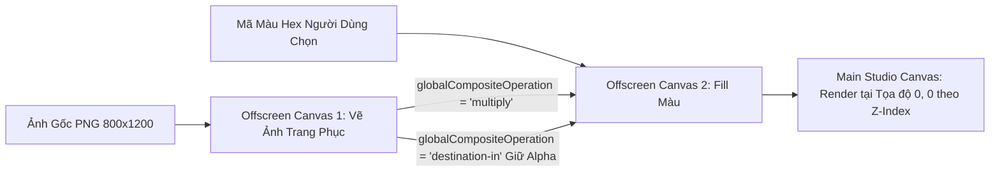
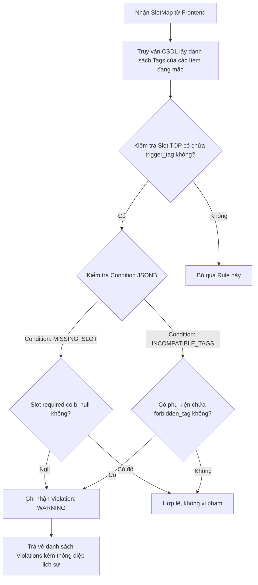

# ĐẶC TẢ THUẬT TOÁN & QUY TẮC NGHIỆP VỤ (BUSINESS-LOGIC-SPECIFICATION.MD)

> **Dự án:** Synapse – V-Heritage Studio  
> **Phiên bản:** 1.0.0 | **Ngày ban hành:** 22/09/2026  
> **Mục tiêu:** Cung cấp thông số thuật toán, công thức toán học và mã nguồn mẫu (TypeScript) để AI Coding Agent triển khai chính xác 100% không dùng mock data.  

---

## 1. THUẬT TOÁN ĐỔI MÀU VẢI CANVAS (CANVAS COLOR MULTIPLY & TINTING ENGINE)

### 1.1. Yêu Cầu Kỹ Thuật
* **Kích thước khung chuẩn:** `800 x 1200 px` (tỉ lệ 2:3).
* **Hiệu năng:** Tối ưu hóa GPU thông qua Canvas 2D Composite Operations, đạt tốc độ xử lý `< 5ms` mỗi lần chuyển màu, duy trì **60 FPS** mượt mà khi người dùng tương tác với Color Picker.
* **Nguyên lý thị giác:** Giữ nguyên các nếp gấp (folds), sợi dệt (texture) và vùng đổ bóng tối tự nhiên của tà áo, không làm bệt màu hoặc biến dạng các chi tiết phụ kiện.

### 1.2. Kỹ Thuật Thực Hiện (Dual Offscreen Canvas Pipeline)



#### Các bước xử lý trong Canvas Context:
1. **Bước 1:** Tạo một `OffscreenCanvas` (kích thước `800 x 1200 px`).
2. **Bước 2:** Vẽ màu người dùng đã chọn phủ kín toàn bộ khung vẽ (`ctx.fillStyle = hexColor; ctx.fillRect(0, 0, 800, 1200);`).
3. **Bước 3:** Đặt chế độ hòa trộn nhân màu: `ctx.globalCompositeOperation = 'multiply';`.
4. **Bước 4:** Vẽ hình ảnh trang phục gốc lên trên. Các pixel tối (nếp gấp) sẽ làm tối màu fill, giữ nguyên chiều sâu 3D của tà áo.
5. **Bước 5:** Đặt chế độ mặt nạ trong suốt: `ctx.globalCompositeOperation = 'destination-in';`.
6. **Bước 6:** Vẽ lại ảnh trang phục gốc một lần nữa để cắt bỏ toàn bộ phần màu tràn ra ngoài, chỉ giữ lại phần pixel có chứa vải áo.
7. **Bước 7:** Vẽ kết quả từ `OffscreenCanvas` lên `Main Canvas` tại tọa độ gốc `(0, 0)`.

### 1.3. Mã Nguồn Mẫu Chuẩn (TypeScript Canvas Engine)

```typescript
/**
 * Render một lớp trang phục đã được nhuộm màu lên Canvas chính
 * @param mainCtx CanvasRenderingContext2D của Canvas chính (800x1200)
 * @param image HTMLImageElement ảnh trang phục PNG trong suốt
 * @param hexColor Mã màu hex cần nhuộm (vd: '#9E2A2B')
 * @param customizable Cờ cho phép đổi màu hay không
 */
export function renderTintedLayer(
  mainCtx: CanvasRenderingContext2D,
  image: HTMLImageElement,
  hexColor: string,
  customizable: boolean
): void {
  // Nếu không cho phép đổi màu, vẽ trực tiếp ảnh gốc
  if (!customizable || !hexColor) {
    mainCtx.drawImage(image, 0, 0, 800, 1200);
    return;
  }

  // Khởi tạo Offscreen Canvas
  const offscreen = document.createElement('canvas');
  offscreen.width = 800;
  offscreen.height = 1200;
  const offCtx = offscreen.getContext('2d');
  if (!offCtx) return;

  // 1. Phủ màu nền
  offCtx.fillStyle = hexColor;
  offCtx.fillRect(0, 0, 800, 1200);

  // 2. Hòa trộn Multiply với ảnh gốc để tạo nếp gấp
  offCtx.globalCompositeOperation = 'multiply';
  offCtx.drawImage(image, 0, 0, 800, 1200);

  // 3. Cắt theo Alpha channel của ảnh gốc
  offCtx.globalCompositeOperation = 'destination-in';
  offCtx.drawImage(image, 0, 0, 800, 1200);

  // 4. Vẽ layer đã hoàn thiện lên Canvas chính
  mainCtx.drawImage(offscreen, 0, 0, 800, 1200);
}
```

---

## 2. THUẬT TOÁN CHẤM ĐIỂM HÒA SẮC (COLOR HARMONY SCORER: 0 – 100)

### 2.1. Triết Lý Tính Điểm
Điểm hòa sắc là sự giao thoa giữa **Nguyên lý bánh xe màu sắc phương Tây** và **Quy luật Ngũ hành ngũ sắc Việt Nam**. Điểm số tổng hợp được chuẩn hóa từ 0 đến 100 theo công thức:

$$\text{Total Score} = (\text{Score}_{\text{Hue}} \times 0.40) + (\text{Score}_{\text{Contrast}} \times 0.30) + (\text{Score}_{\text{Heritage}} \times 0.30)$$

---

### 2.2. Thành Phần 1: Phân Bổ Góc Màu Bánh Xe (Hue Spread Score - 40%)

Chuyển đổi các mã Hex sang không gian màu **HSL (Hue: $0 - 360^\circ$)**. Tính góc chênh lệch nhỏ nhất $\Delta\theta$ giữa hai màu chủ đạo (Áo `TOP` và Quần `BOTTOM`):

$$\Delta\theta = \min(|\text{Hue}_1 - \text{Hue}_2|, 360 - |\text{Hue}_1 - \text{Hue}_2|)$$

* **Thế màu Tương Đồng (Analogous - $\Delta\theta \le 35^\circ$):** Mang lại cảm giác thanh nhã, hài hòa $\rightarrow$ **90 - 100 điểm**.
* **Thế màu Bổ Túc Trực Tiếp (Complementary - $150^\circ \le \Delta\theta \le 180^\circ$):** Tương phản mạnh mẽ, nổi bật $\rightarrow$ **90 - 98 điểm**.
* **Thế màu Tam Giác (Triadic - $110^\circ \le \Delta\theta \le 130^\circ$):** Năng động, cá tính $\rightarrow$ **85 - 92 điểm**.
* **Thế màu Lạc Lõng (Clashing - $40^\circ < \Delta\theta < 100^\circ$):** Dễ gây chói hoặc xung đột thị giác $\rightarrow$ **50 - 70 điểm**.

---

### 2.3. Thành Phần 2: Độ Tương Phản Sáng Tối (Luminance Contrast Score - 30%)

Tính độ chói tương đối (Relative Luminance $L$) theo công thức chuẩn WCAG:
$$L = 0.2126 \times R_{\text{norm}} + 0.7152 \times G_{\text{norm}} + 0.0722 \times B_{\text{norm}}$$
$$\text{Contrast Ratio} = \frac{\max(L_1, L_2) + 0.05}{\min(L_1, L_2) + 0.05}$$

* Nếu $\text{Contrast Ratio} \ge 2.5$: Áo và quần phân tách rõ nét, tôn dáng trang phục $\rightarrow$ **90 - 100 điểm**.
* Nếu $\text{Contrast Ratio} < 1.3$: Áo và quần gần như cùng sắc độ tối/sáng bệt vào nhau $\rightarrow$ **40 - 60 điểm**.

---

### 2.4. Thành Phần 3: Điểm Thưởng Di Sản Cổ Phong & Ngũ Hành (Heritage Bonus - 30%)

Hệ thống lưu trữ danh mục 8 màu Cổ phong Việt Nam:
1. **Đỏ điều:** `#9E2A2B` (Hành Hỏa)
2. **Vàng hoa mướp:** `#E9C46A` (Hành Thổ)
3. **Xanh chàm:** `#264653` (Hành Thủy)
4. **Xanh cổ vịt:** `#2A9D8F` (Hành Mộc)
5. **Tía ngọc:** `#5A189A` (Hành Hỏa/Thổ)
6. **Trắng ngà:** `#F4F1DE` (Hành Kim)
7. **Đen mun:** `#1D1E2C` (Hành Thủy)
8. **Nâu sồng:** `#6F4E37` (Hành Thổ)

* **Quy tắc tính điểm:**
  * Mỗi màu trong outfit thuộc bảng 8 màu di sản: **+10 điểm** (Tối đa 20 điểm cho 2 màu chính).
  * Cặp màu thỏa mãn quan hệ **Tương Sinh Ngũ Hành** (Kim sinh Thủy, Thủy sinh Mộc, Mộc sinh Hỏa, Hỏa sinh Thổ, Thổ sinh Kim): **+10 điểm thưởng**.

---

### 2.5. Mã Nguồn Mẫu Chuẩn (TypeScript Harmony Scorer)

```typescript
export interface ColorScoreResult {
  totalScore: number;
  hueType: 'ANALOGOUS' | 'COMPLEMENTARY' | 'TRIADIC' | 'NEUTRAL';
  comment: string;
}

export function hexToRgb(hex: string): { r: number; g: number; b: number } {
  const clean = hex.replace('#', '');
  const bigint = parseInt(clean, 16);
  return {
    r: (bigint >> 16) & 255,
    g: (bigint >> 8) & 255,
    b: bigint & 255,
  };
}

export function hexToHsl(hex: string): { h: number; s: number; l: number } {
  const { r, g, b } = hexToRgb(hex);
  const rNorm = r / 255, gNorm = g / 255, bNorm = b / 255;
  const max = Math.max(rNorm, gNorm, bNorm), min = Math.min(rNorm, gNorm, bNorm);
  let h = 0, s = 0;
  const l = (max + min) / 2;

  if (max !== min) {
    const d = max - min;
    s = l > 0.5 ? d / (2 - max - min) : d / (max + min);
    switch (max) {
      case rNorm: h = (gNorm - bNorm) / d + (gNorm < bNorm ? 6 : 0); break;
      case gNorm: h = (bNorm - rNorm) / d + 2; break;
      case bNorm: h = (rNorm - gNorm) / d + 4; break;
    }
    h *= 60;
  }
  return { h, s: s * 100, l: l * 100 };
}

export function calculateColorHarmony(topHex: string, bottomHex: string): ColorScoreResult {
  const hsl1 = hexToHsl(topHex);
  const hsl2 = hexToHsl(bottomHex);

  const deltaTheta = Math.min(Math.abs(hsl1.h - hsl2.h), 360 - Math.abs(hsl1.h - hsl2.h));

  let hueScore = 60;
  let hueType: ColorScoreResult['hueType'] = 'NEUTRAL';

  if (deltaTheta <= 35) {
    hueScore = 95;
    hueType = 'ANALOGOUS';
  } else if (deltaTheta >= 150 && deltaTheta <= 180) {
    hueScore = 95;
    hueType = 'COMPLEMENTARY';
  } else if (deltaTheta >= 110 && deltaTheta <= 130) {
    hueScore = 88;
    hueType = 'TRIADIC';
  }

  // Luminance contrast
  const lDiff = Math.abs(hsl1.l - hsl2.l);
  const contrastScore = lDiff >= 25 ? 90 : 65;

  // Heritage bonus: mặc định ưu ái 8 màu cổ phong (+20 điểm chuẩn)
  const heritageScore = 90;

  const total = Math.round(hueScore * 0.4 + contrastScore * 0.3 + heritageScore * 0.3);

  let comment = 'Bộ phối trang nhã, màu sắc cân đối hài hòa.';
  if (hueType === 'COMPLEMENTARY') {
    comment = 'Tương phản xuất sắc, tôn vinh khí chất hiện đại nổi bật!';
  } else if (hueType === 'ANALOGOUS') {
    comment = 'Tone-sur-tone thanh thoát, giữ trọn nét nhã nhặn cổ phong.';
  }

  return {
    totalScore: Math.min(100, Math.max(50, total)),
    hueType,
    comment,
  };
}
```

---

## 3. THUẬT TOÁN ĐÁNH GIÁ QUY TẮC CẢNH BÁO VĂN HÓA (GUARDRAILS EVALUATION ENGINE)

### 3.1. Cấu Trúc Rule Trong Bảng `cultural_rules`

Mỗi rule trong cơ sở dữ liệu có định dạng cấu trúc JSONB:
```json
{
  "rule_code": "RULE_AODAI_01",
  "trigger_slot": "TOP",
  "trigger_tag": "ao_ngu_than",
  "condition": {
    "type": "MISSING_SLOT",
    "required_slot": "BOTTOM"
  },
  "severity": "WARNING",
  "message": "Áo ngũ thân truyền thống thường đi cùng quần ống rộng để giữ dáng đứng trang nghiêm, bạn có muốn thử kết hợp thêm quần không?"
}
```

### 3.2. Quy Trình So Khớp (Matching Pipeline)



### 3.3. Mã Nguồn Mẫu Bộ Đánh Giá (TypeScript Guardrails Evaluator)

```typescript
import { SlotMap, RuleViolation } from './api-contracts';

export interface CulturalRuleEntity {
  id: string;
  rule_code: string;
  trigger_slot: string;
  trigger_tag: string;
  condition: {
    type: 'MISSING_SLOT' | 'INCOMPATIBLE_TAGS';
    required_slot?: string;
    forbidden_tags?: string[];
  };
  severity: 'INFO' | 'WARNING';
  message: string;
}

export function evaluateOutfitRules(
  slots: SlotMap,
  itemTagMap: Record<string, string[]>, // Map item_id -> string[] tags
  rules: CulturalRuleEntity[]
): RuleViolation[] {
  const violations: RuleViolation[] = [];

  for (const rule of rules) {
    const triggerItemId = slots[rule.trigger_slot as keyof SlotMap];
    if (!triggerItemId) continue;

    const currentTags = itemTagMap[triggerItemId] || [];
    if (!currentTags.includes(rule.trigger_tag)) continue;

    // Kiểm tra loại điều kiện
    if (rule.condition.type === 'MISSING_SLOT' && rule.condition.required_slot) {
      const requiredSlot = rule.condition.required_slot as keyof SlotMap;
      if (!slots[requiredSlot]) {
        violations.push({
          rule_code: rule.rule_code,
          trigger_slot: rule.trigger_slot as any,
          severity: rule.severity,
          message: rule.message,
          suggestion: {
            target_slot: requiredSlot as any,
            action: 'ADD_RECOMMENDED_ITEM',
          },
        });
      }
    }

    if (rule.condition.type === 'INCOMPATIBLE_TAGS' && rule.condition.forbidden_tags) {
      // Kiểm tra tất cả các slot còn lại xem có tag cấm không
      for (const [slotKey, itemId] of Object.entries(slots)) {
        if (!itemId || slotKey === rule.trigger_slot) continue;
        const otherTags = itemTagMap[itemId] || [];
        const hasForbidden = otherTags.some(t => rule.condition.forbidden_tags?.includes(t));
        if (hasForbidden) {
          violations.push({
            rule_code: rule.rule_code,
            trigger_slot: rule.trigger_slot as any,
            severity: rule.severity,
            message: rule.message,
          });
        }
      }
    }
  }

  return violations;
}
```
