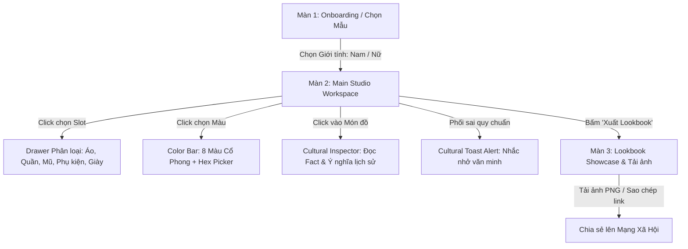

# KẾ HOẠCH PHÁT TRIỂN DỰ ÁN MVP (PLAN.MD)

**Chủ đề:** Nền Tảng Phối Trang Phục Truyền Thống Theo Phong Cách Gen Z
**Tên dự án:** Synapse – V-Heritage Studio
**Ngày cập nhật:** 21/09/2026 | **Hạn chót bàn giao (Deadline):** 07/10/2026 (16 ngày)

---

## 1. TỔNG QUAN DỰ ÁN & ĐỘI NGŨ (TEAM & TIMELINE)

### 1.1. Mục tiêu cốt lõi

Xây dựng công cụ thời trang sáng tạo (Fashion-Tech Studio) kết hợp không gian khám phá tri thức văn hóa (Cultural Hub) cho giới trẻ. Hỗ trợ phối đồ cho cả **Nam** và **Nữ**.

### 1.2. Phân công vai trò (Team Roles)

* **Leader (Lead Dev & Product Owner):**
  * Thiết kế kiến trúc, làm việc với AI Coding Agent để code toàn bộ Frontend, Backend, Canvas Engine và tích hợp Database.
* **2 Thành viên (Kinh tế & Nghiên cứu):**
  * Nghiên cứu tư liệu lịch sử, thu thập/chuẩn hóa hình ảnh trang phục (bóc nền).
  * Viết nội dung fact văn hóa, xây dựng bộ quy tắc cảnh báo (Cultural Rules).
  * Chuẩn bị tài liệu kinh doanh, kịch bản thuyết trình/báo cáo.

### 1.3. Lịch trình 16 ngày (Agile Fast-Track)

* **Sprint 0 (21/09 - 23/09):** Thiết lập kiến trúc, khởi tạo Repo FE/BE, tạo Database Supabase và ban hành chuẩn hình ảnh cho 2 bạn research.
* **Sprint 1 (24/09 - 29/09):** Core Canvas Engine & Catalog API (Phối đồ 6 slot, đổi màu cơ bản, thẻ giải nghĩa văn hóa).
* **Sprint 2 (30/09 - 05/10):** Cultural Guardrails Engine & Xuất Lookbook (Cảnh báo sai lệch, chấm điểm hòa sắc, xuất ảnh chia sẻ).
* **Sprint 3 (06/10 - 07/10):** Đổ dữ liệu thật từ team research, kiểm thử toàn diện, Deploy miễn phí lên Vercel + Render và tổng duyệt demo.

---

## 2. THIẾT KẾ TRẢI NGHIỆM & BỐ CỤC UI/UX (UI/UX EXPERIENCE FLOW & WIREFRAME)

### 2.1. Bản đồ Hành trình Người dùng (End-to-End User Journey)



### 2.2. Chi tiết 3 Màn hình Cốt lõi (Screen-by-Screen Specification)

#### Màn 1: Khởi tạo & Chọn Mẫu (Onboarding & Persona Setup)

* **Giao diện:** Tối giản, thẩm mỹ cao (Hero banner dạng Neo-Heritage).
* **Hành động người dùng:**
  * Chọn phom mẫu: **Nam** hoặc **Nữ** (hiển thị hình bóng silhouette 2D hiện đại).
  * (Tùy chọn) Chọn Vibe cảm hứng: *Streetwear, Hoài niệm (Retro), Tối giản (Minimalist), Cung đình (Royal)* để hệ thống gợi ý sẵn một bộ phối cơ bản.
  * Nút Call-to-Action: *"Bắt đầu Phối đồ"* $\rightarrow$ Chuyển mượt (fade transition) vào Studio.

#### Màn 2: Không gian Phối đồ Chính (Canva-Inspired Studio Workspace)

Kế thừa trọn vẹn mô hình UX của **Canva Editor** (chuẩn mực ứng dụng sáng tạo):

* **Bố cục 4 Phân Vùng trên Máy tính (Desktop Layout):**

  1. **Thanh Icon Dock dọc (Bên trái cùng - 70px):**
     * Danh sách icon chức năng cố định:
       * `[👔 Trang phục]` (Áo ngũ thân, áo tấc, áo lót, quần).
       * `[👒 Mũ & Mấn]` (Khăn đóng, mấn triều Nguyễn, nón quai thao).
       * `[💎 Phụ kiện]` (Quạt lụa, ngọc bội, kính râm, sneaker, túi xách).
       * `[🎨 Bảng màu]` (Bảng 8 màu cổ phong Việt Nam & Color Picker).
       * `[🤖 AI Stylist]` (Ô chat prompt gợi ý thông minh - *Đặt placeholder cho sau MVP*).
       * `[📁 Đã lưu]` (Xem lại các bộ Lookbook cá nhân).
  2. **Ngăn Kéo Chi Tiết (Active Drawer Panel - 320px):**
     * Khi click vào một icon ở Dock, ngăn này sẽ trượt mở ra:
     * **Phía trên cùng:** Ô input *"Mô tả outfit hoặc sự kiện bạn muốn..."* kèm icon AI Magic và nút *"Tìm kiếm / Gợi ý"*.
     * **Phía dưới chia các ngăn (Accordion Sections):**
       * *Ngăn "Đang mặc trên người" (Active Layers quản lý Z-Index)*.
       * *Ngăn "Thời kỳ Triều Nguyễn"* / *"Cổ phục Dân gian"*.
       * *Ngăn "Phụ kiện Phá cách Gen Z"*.
  3. **Khung nhìn Canvas Trung tâm (Main Canvas Viewport):**
     * Mannequin 2D tỉ lệ 2:3 đặt ở giữa với cơ chế xếp lớp cố định (Paper-Doll Overlay).
     * Phía dưới Canvas: Thanh 8 chấm màu cổ phong Việt Nam + Bộ điều khiển (Zoom in/out, Undo/Redo, Reset).
  4. **Topbar & Cột Phải (Cultural Inspector & Action Bar):**
     * Topbar: Nút chọn phom mẫu Nam/Nữ, Tên tác phẩm, và nút nổi bật tím gradient **[✨ Xuất V-Lookbook]** (tương tự nút "Chia sẻ" của Canva).
     * Cột phải: Thẻ tri thức văn hóa (Cultural Factcard) tự động đổi bài khi click vào trang phục + Radar cân bằng Cổ điển/Hiện đại + Banner cảnh báo văn hóa tinh tế.
* **Bố cục trên Điện thoại (Mobile Responsive Layout - Chuẩn hóa Canva Mobile):**

  * Nửa trên cố định (55%): Khung Canvas Mannequin hiển thị toàn vẹn.
  * Nửa dưới (45%): Thanh Bottom Navigation chứa các icon (Trang phục, Mũ, Phụ kiện, Màu sắc) vuốt mở Bottom Sheet Drawer để chọn đồ.

#### Màn 3: Triển lãm & Xuất Bản V-Lookbook (Showcase & Export Modal)

* **Giao diện:** Xuất hiện dưới dạng Modal toàn màn hình hoặc trang kết quả lộng lẫy.
* **Nội dung:** Tấm thẻ 9:16 hoàn chỉnh với phom mẫu đã phối, tên tác phẩm do người dùng nhập, bảng màu ngũ sắc, trích dẫn văn hóa và điểm hòa sắc.
* **Tương tác:**
  * Nút `[💾 Tải ảnh PNG]` (tự động render và tải ảnh chất lượng cao về máy).
  * Nút `[🔗 Sao chép Link bộ phối]` (tạo link chia sẻ trực tiếp).
  * Nút `[✏️ Chỉnh sửa tiếp]` (quay lại màn hình Studio giữ nguyên các lớp đồ).

### 2.3. Nguyên tắc Thẩm mỹ & Trải nghiệm (Design Language & Micro-interactions)

* **Phong cách thị giác (Visual Style):** **"Heritage Futurism"** – Giao diện tối màu (Dark mode thanh lịch) hoặc tone giấy dó/be ấm áp (Warm Parchment), kết hợp hiệu ứng kính mờ (Glassmorphism) để tôn lên màu sắc rực rỡ của các lớp cổ phục.
* **Typography:**
  * Tiêu đề & Tên trang phục: Font chữ có chân thanh thoát, mang hơi thở truyền thống Việt (Google Fonts: *Playfair Display* hoặc *Cinzel*).
  * Nội dung & Nút bấm: Font không chân hiện đại, tối ưu hiển thị tiếng Việt hoàn hảo (*Be Vietnam Pro* hoặc *Inter*).
* **Micro-interactions:**
  * Hiệu ứng chuyển động mượt mà khi thay áo/quần (Fade-in nhẹ nhàng trong 150ms).
  * Hiệu ứng khi bấm nút màu: Vải áo chuyển sắc êm dịu, không bị giật lag.
  * Cảnh báo văn hóa hiển thị theo dạng thông báo thân thiện (Friendly Guidance), tuyệt đối không dùng từ ngữ phán xét tiêu cực.

---

## 3. KIẾN TRÚC KỸ THUẬT & HẠ TẦNG (ARCHITECTURE & TECH STACK)

### 3.1. Triết lý thiết kế: Data-Driven & Extensible Architecture

* Xây dựng **bộ khung cỗ máy (Core Engine)** phân chia theo 6 Slot cố định.
* Dữ liệu trang phục, quy tắc văn hóa, câu chuyện lịch sử được quản lý độc lập trên Database, cho phép 2 bạn nghiên cứu tự nạp/sửa dữ liệu qua bảng biểu mà **không cần sửa mã nguồn**.

### 3.2. Tech Stack & Hạ tầng Cloud Miễn Phí (Free 100%)

* **Frontend:** React / Vite + TypeScript + HTML5 Canvas / SVG (Deploy: **Vercel**).
* **Backend:** Node.js (Express hoặc NestJS) + TypeScript (Deploy: **Render.com** - Web Service).
* **Database:** PostgreSQL trên **Supabase** (Sử dụng tính năng Table Editor như Excel để thành viên phi kỹ thuật nhập liệu).

### 3.3. Cơ chế hiển thị Canvas & Quy chuẩn Assets cho Team Research (Đã chốt)

* **Cơ chế Canvas:** Xếp chồng lớp theo kích thước khung chuẩn (**Paper-Doll Overlay**).
* **Quy chuẩn file ảnh:**
  * Định dạng: `.png` trong suốt (transparent).
  * Kích thước khung chuẩn: Cố định `800 x 1200 px` (tỉ lệ 2:3) cho toàn bộ Mannequin, Áo, Quần, Họa tiết, Mũ nón và Giày.
  * Tọa độ: Đặt chính xác vị trí của món đồ trên cơ thể mẫu trước khi xuất file PNG.
  * Lợi ích: Frontend render chỉ việc xếp chồng các thẻ ảnh `` hoặc vẽ lên HTML5 Canvas cùng `(0, 0, 800, 1200)` theo `layer_order` (Z-Index), hoàn toàn không sợ lệch tọa độ trên mobile/desktop.

### 3.4. Cơ chế Đổi Màu Sắc Vải (Đã chốt: Phương án 3 - Lai kết hợp)

* **Bảng màu truyền thống sẵn có (Preset Palettes):** Cung cấp sẵn 8-10 mã màu cổ phong có đặt tên văn hóa chuẩn mực (vd: *Đỏ điều, Vàng hoa mướp, Xanh chàm/thủy ba, Xanh cổ vịt, Tía ngọc, Trắng ngà, Đen mun*).
* **Tự do tùy biến (Custom Hex Picker):** Cho phép người dùng mở rộng bảng màu tự do nếu muốn sáng tạo phá cách hiện đại.
* **Kỹ thuật thực hiện:** Áp dụng bộ lọc hòa trộn màu (Color Multiply / Canvas Pixel Tinting) hoặc nạp biến thể màu qua Supabase.

### 3.5. Cấu trúc Tấm Thẻ V-Lookbook Xuất Bản (Đã chốt)

* **Định dạng:** Tỉ lệ dọc `9:16` (chuẩn Instagram Story / TikTok / Facebook Reel).
* **Các thành phần trên thẻ:**
  1. Header: Logo dự án *Synapse V-Heritage Studio* + Giới tính (Nam/Nữ).
  2. Trung tâm: Hình ảnh Mannequin phối đồ hoàn chỉnh độ phân giải cao.
  3. Thông tin bộ phối: Tên tác phẩm do người dùng đặt (vd: "Dạo Phố Đông Kinh 2026").
  4. Bảng mã màu: Các chấm màu thực tế đã dùng trong bộ đồ kèm tên cổ phong.
  5. Thẻ tri thức văn hóa (Cultural Fact): Tên trang phục chính, triều đại và 1 câu trích dẫn ý nghĩa lịch sử.
  6. Điểm số & Huy hiệu: Điểm hòa sắc (0-100) + Huy hiệu "Chuẩn văn hóa".
  7. Tương tác: Nút "Tải ảnh PNG về máy" + "Sao chép Link chia sẻ".

### 3.6. Cấu Trúc Thư Mục Dự Án Toàn Diện (Project Architecture Blueprint)

Hệ thống được tổ chức theo mô hình tách bạch giữa Giao diện (Frontend), Xử lý dịch vụ (Backend) và Tài liệu kỹ thuật chuẩn (Docs):

```text
Synapse/
├── docs/                                # Kho tài liệu đặc tả chuẩn Agile & RUP
│   ├── PLAN.md                          # Kế hoạch tổng thể & Kiến trúc kiến tạo
│   ├── USER-STORY.md                    # 9 User Stories theo chuẩn BDD (Given-When-Then)
│   ├── USE-CASE.md                      # 8 Use Cases đặc tả chi tiết kèm sơ đồ UML
│   ├── API-CONTRACTS.md                 # Đặc tả 4 nhóm REST API, DTOs & Error Codes
│   └── BUSINESS-LOGIC-SPECIFICATION.md  # Thuật toán Canvas 60 FPS, Harmony Scorer, Guardrails
├── frontend/                            # Ứng dụng Giao diện (React 18 + Vite + TypeScript)
│   ├── public/                          # Static assets, fonts, favicon
│   ├── src/
│   │   ├── assets/                      # Ảnh Mannequin fallback, icons, logos
│   │   ├── canvas/                      # [Core Canvas Paper-Doll Engine]
│   │   │   ├── engine.ts                # Bộ xếp lớp Z-Index 6 slot tọa độ (0, 0)
│   │   │   ├── tinting.ts               # Bộ hòa trộn màu Dual Offscreen Canvas Multiply
│   │   │   └── export.ts                # Render xuất ảnh Blob / PNG chuẩn 9:16
│   │   ├── components/
│   │   │   ├── studio/                  # Workspace chính: CanvasViewport, DockBar, ItemDrawer, ColorBar
│   │   │   ├── cultural/                # CulturalFactcard, GuardrailToast, HarmonyRadar
│   │   │   ├── lookbook/                # LookbookModal, LookbookCard (9:16), ShareButtons
│   │   │   └── ui/                      # Button, Modal, Tooltip, Accordion dùng chung
│   │   ├── store/                       # [Quản trị Trạng thái Toàn cục]
│   │   │   └── useOutfitStore.ts        # Zustand Store quản lý 6 slot, màu sắc, undo/redo
│   │   ├── services/                    # [Tầng Gọi API Tương tác]
│   │   │   └── api.ts                   # Axios / Fetch client kết nối backend REST API
│   │   ├── types/                       # Shared Interfaces kế thừa từ API-CONTRACTS.md
│   │   ├── App.tsx                      # Root App điều phối chuyển cảnh Onboarding <-> Studio
│   │   ├── main.tsx                     # Entry point React Vite
│   │   └── index.css                    # Design System Heritage Futurism (Tailwind / CSS)
│   ├── package.json
│   ├── tsconfig.json
│   └── vite.config.ts
├── backend/                             # Dịch vụ API & Xử lý Nghiệp vụ (Node.js + Express + TS)
│   ├── src/
│   │   ├── controllers/                 # ItemsController, RulesController, LookbooksController
│   │   ├── services/                    # ItemsService, GuardrailsService, LookbooksService
│   │   ├── routes/                      # items.routes.ts, rules.routes.ts, lookbooks.routes.ts
│   │   ├── config/                      # Supabase Client, biến môi trường (PORT, SUPABASE_URL)
│   │   ├── types/                       # Shared DTOs từ API-CONTRACTS.md
│   │   └── index.ts                     # Entrypoint HTTP Server port 5000
│   ├── package.json
│   └── tsconfig.json
├── CONTRIBUTING.md                      # Quy chuẩn Commit, Branching & PR
└── GEMINI.md                            # Ngữ cảnh chỉ dẫn tối cao cho AI Coding Agent
```

### 3.7. Kiến Trúc Quản Trị Trạng Thái Frontend (Zustand Store)

Frontend sử dụng **Zustand** (`useOutfitStore.ts`) làm State Manager duy nhất:
* **Nhẹ & Không Re-render thừa:** Cập nhật độc lập giữa các Slot, tối ưu 60 FPS khi đổi màu vải áo.
* **State Cốt Lõi:**
  * `gender`: `'MALE' | 'FEMALE'`
  * `slots`: `Record<SlotType, { item: ItemDto; color: string } | null>`
  * `activeFactcard`: `CulturalFactDto | null`
  * `guardrailViolations`: `RuleViolation[]`
  * `harmonyScore`: `ColorScoreResult`
  * `history`: Hỗ trợ tính năng `undo()` và `redo()` cho trải nghiệm sáng tạo chuyên nghiệp.

---

## 4. CƠ SỞ DỮ LIỆU CỐT LÕI (CORE DATABASE SCHEMA)

Hệ thống quản lý thông qua 4 bảng chính trên Supabase:

### 4.1. Bảng `items` (Kho trang phục & Phụ kiện)

* `id` (UUID, PK): Định danh món đồ.
* `name` (VARCHAR): Tên món đồ (vd: "Áo ngũ thân tay chẽn", "Nón quai thao").
* `gender` (ENUM): `MALE` | `FEMALE` | `UNISEX`.
* `slot` (ENUM): `TOP` | `BOTTOM` | `PATTERN` | `ACCESSORY` | `FOOTWEAR` | `HEADWEAR`.
* `layer_order` (INT): Thứ tự vẽ layer trên Canvas (Z-Index: 10, 20, 30...).
* `image_url` (TEXT): Đường dẫn ảnh PNG trong suốt đã bóc nền.
* `color_customizable` (BOOLEAN): Cho phép đổi màu hay không.
* `default_color` (VARCHAR): Mã màu hex mặc định.
* `tags` (JSONB): Từ khóa tìm kiếm & lọc (`["nguyen", "formal", "tet", "streetwear"]`).

### 4.2. Bảng `cultural_facts` (Thẻ tri thức văn hóa)

* `id` (UUID, PK).
* `item_id` (UUID, FK $\rightarrow$ `items.id`): Liên kết với món đồ.
* `era` (VARCHAR): Thời kỳ / Triều đại (vd: "Triều Nguyễn - Thế kỷ 19").
* `origin_story` (TEXT): Tóm tắt lịch sử, xuất xứ.
* `symbolic_meaning` (TEXT): Ý nghĩa cấu trúc (cúc ngũ thường, cổ áo, tà áo...).
* `modern_styling_tip` (TEXT): Gợi ý cách phối hiện đại cho Gen Z.

### 4.3. Bảng `cultural_rules` (Quy tắc kiểm tra văn hóa - Guardrails Engine)

* `id` (UUID, PK).
* `rule_code` (VARCHAR): Mã luật (vd: `RULE_AODAI_01`).
* `trigger_slot` (VARCHAR): Slot kích hoạt (vd: `TOP`).
* `trigger_tag` (VARCHAR): Tag kích hoạt (vd: `ao_ngu_than`).
* `condition` (JSONB): Điều kiện vi phạm (vd: `{"type": "MISSING_SLOT", "required_slot": "BOTTOM"}`).
* `severity` (ENUM): `INFO` | `WARNING`.
* `message` (TEXT): Thông điệp nhắc nhở văn minh, tinh tế.

### 4.4. Bảng `lookbooks` (Bộ phối người dùng đã lưu)

* `id` (UUID, PK).
* `title` (VARCHAR): Tên tác phẩm do người dùng đặt.
* `gender` (VARCHAR): `MALE` | `FEMALE`.
* `outfit_data` (JSONB): Danh sách các item và mã màu đã phối.
* `harmony_score` (INT): Điểm hòa sắc (0 - 100).
* `created_at` (TIMESTAMP).

---

## 5. TIÊU CHUẨN HOÀN THÀNH MVP CORE (DEFINITION OF DONE)

1. Có Mannequin Nam & Nữ chuẩn phom dáng.
2. Người dùng có thể click chọn và đổi đồ trực quan trên Canvas theo 6 slot cơ bản.
3. Thay đổi được màu sắc vải của áo/quần cơ bản (Thuật toán Multiply 60 FPS).
4. Chọn đồ đến đâu, Thẻ tri thức văn hóa (Cultural Factcard) cập nhật thông tin tương ứng.
5. Cảnh báo hiển thị khi vi phạm quy tắc đơn giản đã cài sẵn (vd: Áo dài ngũ thân không có quần).
6. Chấm điểm hòa sắc tự động (Color Harmony Scorer 0-100) dựa trên bánh xe màu và ngũ hành.
7. Xuất được ảnh Lookbook 9:16 hoàn chỉnh để tải về hoặc chia sẻ link trực tiếp.
8. Triển khai thành công trên môi trường trực tuyến (Vercel + Render + Supabase) truy cập công khai.

---

## 6. PHÂN RÃ PRODUCT BACKLOG & KẾ HOẠCH TỪNG SPRINT (SPRINT BREAKDOWN)

> Toàn bộ các Task dưới đây được đồng bộ 100% với **Notion Inline Database** (`📌 Synapse – Sprint Backlog & Task Tracker`), **USER-STORY.md** và **USE-CASE.md**.

### SPRINT 0 (21/09 - 23/09): KHỞI TẠO NỀN TẢNG & CHUẨN HÓA DỮ LIỆU
* **Mục tiêu Sprint (Sprint Goal):** Dựng xong khung repo Monorepo/Multi-folder, kết nối CSDL Supabase và ban hành chuẩn ảnh 800x1200 cho team Research.

* **[S0.1] Thiết lập Git Governance, CONTRIBUTING.md & GEMINI.md**
  * *Assignee:* Leader (Dev / PO) | *Priority:* `🔴 P0 - Blocker` | *Liên kết:* Khung quản trị
  * *DoD:* Branch protection rules (main, dev); tài liệu CONTRIBUTING.md và GEMINI.md chuẩn mực.
* **[S0.2] Tạo CSDL Supabase & Migration 4 bảng cốt lõi**
  * *Assignee:* Leader (Dev / PO) | *Priority:* `🔴 P0 - Blocker` | *Liên kết:* US-09, UC-08
  * *DoD:* Tạo 4 bảng (`items`, `cultural_facts`, `cultural_rules`, `lookbooks`), RLS policies và Bucket Storage `item-assets`.
* **[S0.3] Scaffold cấu trúc thư mục Frontend & Backend**
  * *Assignee:* Leader (Dev / PO) | *Priority:* `🟠 P1 - High` | *Liên kết:* US-01, UC-01
  * *DoD:* Khởi tạo `frontend/` (React + Vite + TS + Tailwind) và `backend/` (Node Express + TS); cài đặt Zustand; build pass.
* **[S0.4] Thu thập & Bóc nền 2 Mannequin Nam/Nữ chuẩn 800x1200 px**
  * *Assignee:* Research Member 2 (Assets) | *Priority:* `🔴 P0 - Blocker` | *Liên kết:* US-01, UC-01
  * *DoD:* 2 ảnh PNG trong suốt 800x1200 px tỉ lệ 2:3, bóc nền sạch, căn chuẩn vị trí trung tâm Canvas `(0, 0)`.
* **[S0.5] Soạn thảo Fact văn hóa & 2-3 quy tắc cảnh báo mẫu thời Nguyễn**
  * *Assignee:* Research Member 1 (Content) | *Priority:* `🟠 P1 - High` | *Liên kết:* US-05, US-06
  * *DoD:* Fact văn hóa có trích dẫn sử liệu (không bịa đặt), 2-3 quy tắc cảnh báo mang giọng điệu gợi ý tích cực.

---

### SPRINT 1 (24/09 - 29/09): CORE CANVAS ENGINE & CATALOG API
* **Mục tiêu Sprint (Sprint Goal):** Hoàn thiện trải nghiệm phối đồ 6 slot trên màn hình, đổi màu bằng Dual Offscreen Canvas và tra cứu Cultural Factcard.

* **[S1.1] Xây dựng Core Canvas Paper-Doll Engine (Xếp lớp 6 slot)**
  * *Assignee:* Leader (Dev / PO) | *Priority:* `🔴 P0 - Blocker` | *Liên kết:* US-02, UC-02
  * *DoD:* Cơ chế vẽ xếp lớp 6 slot theo Z-Index (`HEADWEAR` 60, `ACCESSORY` 50, `PATTERN` 40, `TOP` 30, `BOTTOM` 20, `MANNEQUIN` 0) trên Canvas 800x1200; mượt 60 FPS.
* **[S1.2] Phát triển API Catalog & Thẻ Cultural Factcard**
  * *Assignee:* Leader (Dev / PO) | *Priority:* `🟠 P1 - High` | *Liên kết:* US-05, UC-04, API Nhóm 1 & 2
  * *DoD:* API `GET /api/items` và `GET /api/items/:id/facts`; UI Factcard popover hiển thị niên đại, ý nghĩa và tip phối Gen Z.
* **[S1.3] Tích hợp Bảng 8 màu Cổ phong & Color Multiply Canvas**
  * *Assignee:* Leader (Dev / PO) | *Priority:* `🟠 P1 - High` | *Liên kết:* US-03, US-04, UC-03
  * *DoD:* Bảng 8 màu Cổ phong + Hex Color Picker; thuật toán `renderTintedLayer` (Dual Offscreen Canvas) êm ái, không làm bệt nếp gấp vải.
* **[S1.4] Số hóa & Bóc nền đợt 1: 4-6 trang phục tiêu biểu thời Nguyễn**
  * *Assignee:* Research Member 2 (Assets) | *Priority:* `🔴 P0 - Blocker` | *Liên kết:* US-02, UC-02
  * *DoD:* File PNG trong suốt 800x1200 px của Áo ngũ thân, Áo tấc, Áo Nhật bình, Quần lụa, Khăn đóng up lên Supabase Storage.

---

### SPRINT 2 (30/09 - 05/10): CULTURAL GUARDRAILS & LOOKBOOK EXPORT
* **Mục tiêu Sprint (Sprint Goal):** Hoàn thiện bộ não cảnh báo văn hóa tinh tế, thuật toán chấm điểm hòa sắc mỹ thuật và xuất thẻ Lookbook 9:16 chia sẻ mạng xã hội.

* **[S2.1] Xây dựng API & Toast Cảnh Báo Cultural Guardrails**
  * *Assignee:* Leader (Dev / PO) | *Priority:* `🔴 P0 - Blocker` | *Liên kết:* US-06, UC-05, API Nhóm 3
  * *DoD:* API `POST /api/rules/evaluate` theo Slot-Map Contract; Toast Alert màu hổ phách/vàng thân thiện khi phát hiện vi phạm (áo thiếu quần...).
* **[S2.2] Triển khai Thuật toán Chấm Điểm Hòa Sắc (Color Harmony Scorer)**
  * *Assignee:* Leader (Dev / PO) | *Priority:* `🟠 P1 - High` | *Liên kết:* US-07, UC-06
  * *DoD:* Hàm `calculateColorHarmony` tính điểm 0-100 dựa trên Hue spread, Luminance contrast và Heritage bonus; hiển thị trên Radar Chart.
* **[S2.3] Xây dựng V-Lookbook Card Component & Tính Năng Xuất Ảnh 9:16**
  * *Assignee:* Leader (Dev / PO) | *Priority:* `🔴 P0 - Blocker` | *Liên kết:* US-08, UC-07, API Nhóm 4
  * *DoD:* Thẻ tỷ lệ 9:16 Cinematic; xuất file ảnh PNG tải về máy dưới 2 giây; API `POST /api/lookbooks` tạo link chia sẻ trực tiếp.
* **[S2.4] Nhập liệu hoàn chỉnh bộ quy tắc văn hóa & User Testing**
  * *Assignee:* Research Member 1 & 2 | *Priority:* `🟠 P1 - High` | *Liên kết:* US-06, US-09, UC-08
  * *DoD:* Nhập tối thiểu 5-8 quy tắc vào bảng `cultural_rules`; tự tay test phối đồ và phản biện nội dung hiển thị.

---

### SPRINT 3 (06/10 - 07/10): TRIỂN KHAI CLOUD & TỔNG DUYỆT (HARDENING)
* **Mục tiêu Sprint (Sprint Goal):** Đưa sản phẩm lên Internet công khai (Render + Vercel), kiểm thử tải trang di động/desktop và hoàn thiện hồ sơ dự thi Audition.

* **[S3.1] Triển khai Backend lên Render.com & Frontend lên Vercel**
  * *Assignee:* Leader (Dev / PO) | *Priority:* `🔴 P0 - Blocker` | *Liên kết:* US-01 -> US-08
  * *DoD:* Web Service Render chạy ổn định kết nối Supabase; Vercel deploy HTTPS mượt mà, không lỗi CORS.
* **[S3.2] Kiểm thử Tương thích Đa nền tảng & Tối ưu Hiệu năng**
  * *Assignee:* Leader (Dev / PO) | *Priority:* `🟠 P1 - High` | *Liên kết:* Toàn bộ UC
  * *DoD:* Responsive chuẩn trên cả Mobile (Canva Mobile style) và Desktop (Canva Desktop style); Canvas mượt 60 FPS.
* **[S3.3] Tổng duyệt Kịch bản Demo & Hoàn thiện Hồ sơ Bài thi**
  * *Assignee:* Cả Team (Leader + 2 Research) | *Priority:* `🔴 P0 - Blocker` | *Liên kết:* ProjectBrief.md
  * *DoD:* Video demo ngắn (5-10 phút), Slide thuyết trình, link web live và mã nguồn GitHub sẵn sàng nộp bài.
