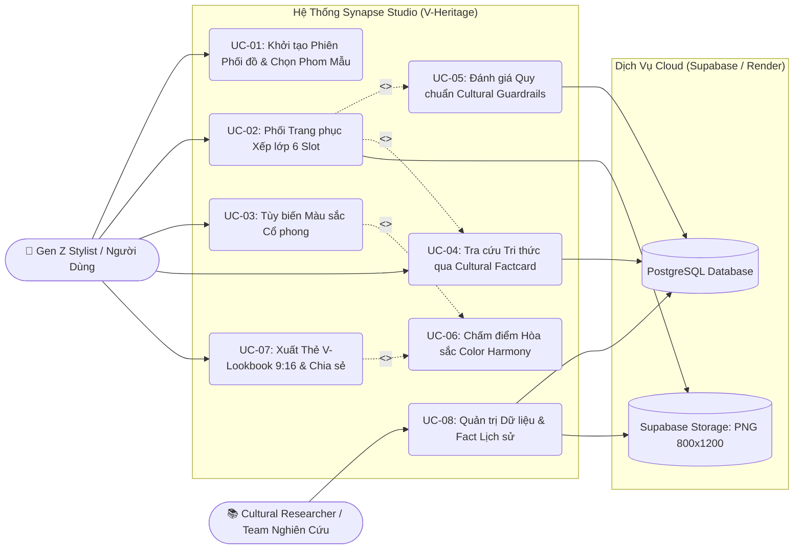

# TÀI LIỆU ĐẶC TẢ USE CASE (USE-CASE.MD)

> **Dự án:** Synapse – V-Heritage Studio  
> **Chủ đề:** Nền tảng phối trang phục truyền thống theo phong cách Gen Z  
> **Phương pháp luận:** RUP / UML Standard Use Case Specification  
> **Ngày phê duyệt:** 22/09/2026 | **Phiên bản:** 1.0.0  

---

## 1. MÔ HÌNH TỔNG QUAN USE CASE (USE CASE DIAGRAM)

---

## 2. DANH SÁCH TÁC NHÂN (ACTORS)

| Tác nhân (Actor) | Phân loại | Mô tả vai trò trong hệ thống |
| :--- | :--- | :--- |
| **Gen Z Stylist / Người dùng** | Primary Actor | Người trực tiếp sử dụng web để phối trang phục, tìm hiểu kiến thức lịch sử, tùy biến màu sắc và xuất ảnh Lookbook chia sẻ. |
| **Cultural Researcher** | Primary Actor | Thành viên phi kỹ thuật quản lý nguồn sử liệu, nạp fact văn hóa, hình ảnh trang phục và thiết lập quy tắc cảnh báo phối đồ. |
| **Core Canvas Engine** | System Actor | Đảm nhận việc vẽ xếp lớp ảnh PNG 800x1200 px theo Z-Index, áp dụng bộ lọc hòa trộn màu (Color Multiply) ở 60 FPS. |
| **Cultural Guardrails Engine** | System Actor | Kiểm tra cấu trúc outfit người dùng vừa chọn đối chiếu với bảng `cultural_rules` để hiển thị gợi ý lịch sự. |
| **Supabase Cloud Service** | Secondary / External | Cung cấp PostgreSQL lưu trữ dữ liệu danh mục và Storage chứa ảnh PNG trong suốt đã bóc nền. |

---

## 3. ĐẶC TẢ CHI TIẾT TỪNG USE CASE (DETAILED SPECIFICATIONS)

---

### UC-01: Khởi Tạo Phiên Phối Đồ & Chọn Phom Mẫu

* **Mã Use Case:** `UC-01`
* **Tên Use Case:** Khởi tạo Phiên Phối đồ & Chọn Phom Mẫu
* **Tác nhân chính:** Gen Z Stylist / Người dùng
* **Mục tiêu:** Bắt đầu phiên làm việc trong Studio với phom dáng Mannequin (Nam hoặc Nữ) phù hợp.
* **Điều kiện tiên quyết (Preconditions):** Người dùng truy cập vào trang chủ Synapse trên trình duyệt web.
* **Điều kiện sau (Postconditions):**
  * Giao diện chuyển sang Studio Workspace (Màn 2).
  * Mannequin cơ bản của giới tính đã chọn hiển thị ở tọa độ trung tâm Canvas.
  * Danh mục trang phục trong Drawer tự động lọc theo giới tính đã chọn.

#### Luồng sự kiện chính (Main Flow):
1. Người dùng mở trang web, hệ thống hiển thị màn hình Onboarding với tiêu đề *Heritage Futurism* và 2 tùy chọn phom mẫu: **Nam** hoặc **Nữ**.
2. Người dùng nhấp chọn hình tượng **Nam** (hoặc **Nữ**).
3. Người dùng nhấp nút **"Bắt đầu Phối đồ"**.
4. Hệ thống thực hiện hiệu ứng chuyển cảnh mượt mà (Fade-in 150ms) vào giao diện Studio.
5. Canvas Engine khởi tạo khung vẽ kích thước `800 x 1200 px` và tải ảnh Mannequin cơ bản.
6. Drawer bên trái hiển thị danh mục các món đồ phù hợp với giới tính tương ứng.

#### Luồng rẽ nhánh (Alternative Flows):
* **2a. Đổi giới tính trực tiếp trong Studio:**
  * Tại Màn 2, người dùng bấm nút chuyển đổi giới tính trên thanh Topbar.
  * Hệ thống cảnh báo: *"Chuyển giới tính sẽ làm mới lại bộ đồ đang phối, bạn có muốn tiếp tục?"*.
  * Nếu người dùng đồng ý, hệ thống đổi Mannequin và tải lại catalog đồ của giới tính mới.

---

### UC-02: Phối Trang Phục Xếp Lớp 6 Slot (Paper-Doll Overlay)

* **Mã Use Case:** `UC-02`
* **Tên Use Case:** Phối Trang phục Xếp lớp 6 Slot
* **Tác nhân chính:** Gen Z Stylist
* **Tác nhân phụ:** Core Canvas Engine, Supabase Storage
* **Mục tiêu:** Thêm, thay thế hoặc tháo bỏ các lớp trang phục vào 6 Slot cố định để tạo outfit.
* **Điều kiện tiên quyết:** Đang ở giao diện Studio Workspace (UC-01 đã hoàn thành).
* **Điều kiện sau:** Canvas hiển thị bộ phối mới với đúng thứ tự layer và không bị lệch tọa độ.

#### Luồng sự kiện chính (Main Flow):
1. Người dùng nhấp chọn một tab trang phục trong Dock bên trái (`TOP`, `BOTTOM`, `HEADWEAR`, `PATTERN`, `ACCESSORY`, `FOOTWEAR`).
2. Drawer trượt mở danh sách các món đồ kèm ảnh thumbnail và tên gọi.
3. Người dùng nhấp chọn một món đồ (vd: "Áo ngũ thân tay chẽn" - Slot `TOP`).
4. Hệ thống tải ảnh PNG trong suốt độ phân giải `800 x 1200 px` từ Supabase Storage.
5. Canvas Engine xóa layer cũ của Slot `TOP` (nếu có), thêm layer mới vào danh sách `ActiveLayers`.
6. Canvas Engine sắp xếp lại toàn bộ các lớp theo `layer_order` (Z-Index):
   $$\text{Mannequin (0)} < \text{BOTTOM (20)} < \text{TOP (30)} < \text{PATTERN (40)} < \text{ACCESSORY (50)} < \text{HEADWEAR (60)}$$
7. Canvas Engine render lại khung vẽ tại tọa độ gốc `(0, 0, 800, 1200)`.
8. Hệ thống tự động kích hoạt **UC-04 (Cập nhật Factcard)** và **UC-05 (Kiểm duyệt Guardrails)**.

#### Luồng rẽ nhánh (Alternative Flows):
* **3a. Tháo bỏ món đồ (Remove/Clear Slot):**
  * Người dùng bấm icon thùng rác / nút gỡ bỏ tại một slot đang mặc.
  * Hệ thống xóa layer đó khỏi Canvas, vẽ lại các layer còn lại.

---

### UC-03: Tùy Biến Màu Sắc Vải Cổ Phong & Tùy Chọn Tự Do

* **Mã Use Case:** `UC-03`
* **Tên Use Case:** Tùy biến Màu sắc Vải Cổ phong & Tùy chọn Tự do
* **Tác nhân chính:** Gen Z Stylist
* **Tác nhân phụ:** Core Canvas Engine, Color Harmony Scorer
* **Mục tiêu:** Thay đổi sắc thái vải của trang phục theo 8 mã màu di sản Việt Nam hoặc mã Hex tự do.
* **Điều kiện tiên quyết:** Có ít nhất một món đồ đang được chọn có thuộc tính `color_customizable = true`.

#### Luồng sự kiện chính (Main Flow):
1. Người dùng chọn món đồ đang mặc trên người (vd: Áo ngũ thân).
2. Thanh Color Bar kích hoạt 8 chấm màu truyền thống:
   * *Đỏ điều (`#9E2A2B`), Vàng hoa mướp (`#E9C46A`), Xanh chàm (`#264653`), Xanh cổ vịt (`#2A9D8F`), Tía ngọc (`#5A189A`), Trắng ngà (`#F4F1DE`), Đen mun (`#1D1E2C`), Nâu sồng (`#6F4E37`)*.
3. Người dùng nhấp vào một chấm màu (vd: "Xanh chàm").
4. Canvas Engine áp dụng thuật toán `multiply` (hòa trộn kênh màu) trên pixel của tà áo, giữ nguyên vùng tối nếp gấp và sợi vải.
5. Canvas cập nhật ngay lập tức mà không tải lại ảnh từ server.
6. Hệ thống gọi **UC-06 (Tính lại điểm hòa sắc)**.

#### Luồng rẽ nhánh (Alternative Flows):
* **3a. Sử dụng Hex Color Picker tự do:**
  * Người dùng bấm icon bảng màu mở rộng và nhập mã Hex hoặc chọn phổ màu tự do.
  * Hệ thống áp dụng màu tùy biến vào lớp vải tương ứng.
* **3b. Trang phục không cho phép đổi màu (`color_customizable = false`):**
  * Đối với các trang phục hoàng cung có quy chế màu sắc nghiêm ngặt (như Áo Nhật bình thêu ngũ sắc), thanh màu bị mờ đi kèm thông điệp giải thích văn hóa.

---

### UC-04: Tra Cứu Tri Thức Văn Hóa & Lịch Sử (Cultural Factcard)

* **Mã Use Case:** `UC-04`
* **Tên Use Case:** Tra cứu Tri thức Văn hóa & Lịch sử
* **Tác nhân chính:** Gen Z Stylist
* **Tác nhân phụ:** Supabase Database (bảng `cultural_facts`)
* **Mục tiêu:** Người dùng nắm được niên đại, ý nghĩa biểu tượng và mẹo phối đồ của món trang phục đang chọn.

#### Luồng sự kiện chính (Main Flow):
1. Người dùng nhấp vào một món đồ trong Drawer hoặc trực tiếp trên người mẫu.
2. Hệ thống truy vấn thông tin văn hóa của món đồ (`GET /api/items/:id/facts`).
3. Cột phải hiển thị Thẻ **Cultural Factcard** với thiết kế trang nhã:
   * **Tên trang phục:** Font chữ có chân thanh thoát (*Cinzel/Playfair*).
   * **Niên đại / Triều đại:** (vd: *Triều Nguyễn - Thế kỷ 19*).
   * **Ý nghĩa cấu trúc:** (vd: *Cúc ngũ thường tượng trưng cho Nhân - Lễ - Nghĩa - Trí - Tín; 5 thân tượng trưng tứ thân phụ mẫu ôm bọc lấy con*).
   * **Mẹo phối Gen Z (Modern Styling Tip):** Gợi ý phụ kiện đi kèm để mặc đẹp trong đời sống hàng ngày.

---

### UC-05: Kiểm Duyệt & Cảnh Báo Quy Chuẩn Phối Đồ (Guardrails Engine)

* **Mã Use Case:** `UC-05`
* **Tên Use Case:** Kiểm duyệt & Cảnh báo Quy chuẩn Phối đồ
* **Tác nhân chính:** Cultural Guardrails Engine (System)
* **Tác nhân hưởng lợi:** Gen Z Stylist
* **Mục tiêu:** Hướng dẫn người dùng phối đồ đúng chuẩn mực văn hóa với thái độ thân thiện, văn minh.

#### Luồng sự kiện chính (Main Flow):
1. Mỗi khi danh sách `ActiveLayers` trên Canvas thay đổi, hệ thống tự động kích hoạt bộ đánh giá (`POST /api/rules/evaluate`).
2. Guardrails Engine so khớp trang phục hiện tại với các quy tắc trong bảng `cultural_rules`.
3. Nếu phát hiện vi phạm quy tắc cơ bản (vd: Mặc áo dài ngũ thân nhưng thiếu quần ở slot `BOTTOM`):
   * Hệ thống hiển thị một **Toast Notification** mềm mại màu hổ phách/vàng ở góc dưới Canvas.
   * Nội dung mang giọng điệu gợi ý tích cực: *"Áo ngũ thân truyền thống thường đi cùng quần ống rộng để giữ dáng đứng trang nghiêm, bạn có muốn thử kết hợp thêm quần không?"*.
4. Người dùng có thể bấm nút gợi ý *"Chọn quần ngay"* để hệ thống tự động mở tab `BOTTOM`.

---

### UC-06: Đánh Giá Điểm Hòa Sắc Trang Phục (Color Harmony Scoring)

* **Mã Use Case:** `UC-06`
* **Tên Use Case:** Đánh giá Điểm Hòa sắc Trang phục
* **Tác nhân chính:** Color Harmony Scorer (System)
* **Mục tiêu:** Chấm điểm mức độ hài hòa màu sắc (0 - 100) của toàn bộ outfit theo nguyên lý phối màu mỹ thuật.

#### Luồng sự kiện chính (Main Flow):
1. Hệ thống thu thập toàn bộ các mã màu hex đang được áp dụng trên các layer (Áo, Quần, Mũ, Phụ kiện).
2. Chuyển đổi mã màu sang không gian màu HSL (Hue, Saturation, Lightness).
3. Áp dụng thuật toán tính toán sự cân bằng:
   * Độ tương phản bổ túc / tương đồng (Complementary, Analogous).
   * Độ hài hòa theo quan niệm Ngũ hành truyền thống (Kim, Mộc, Thủy, Hỏa, Thổ).
4. Xuất ra điểm số tổng hợp (0 - 100) hiển thị trên Radar Chart ở cột phải và gắn kèm vào thẻ Lookbook.

---

### UC-07: Xuất Thẻ V-Lookbook 9:16 & Chia Sẻ Mạng Xã Hội

* **Mã Use Case:** `UC-07`
* **Tên Use Case:** Xuất Thẻ V-Lookbook 9:16 & Chia sẻ Mạng Xã Hội
* **Tác nhân chính:** Gen Z Stylist
* **Tác nhân phụ:** Core Canvas Engine, Supabase Database
* **Mục tiêu:** Tạo và xuất tấm thẻ Lookbook chuẩn tỉ lệ 9:16 để tải ảnh PNG hoặc chia sẻ lên Instagram/TikTok.

#### Luồng sự kiện chính (Main Flow):
1. Người dùng bấm nút nổi bật tím gradient **[✨ Xuất V-Lookbook]** trên Topbar.
2. Hệ thống mở Modal V-Lookbook toàn màn hình, hiển thị tấm thẻ tỉ lệ dọc 9:16:
   * Logo thương hiệu *Synapse V-Heritage Studio*.
   * Ô cho người dùng nhập "Tên tác phẩm của bạn" (vd: *Dạo phố Đông Kinh 2026*).
   * Toàn bộ hình ảnh Canvas phối đồ chất lượng cao.
   * Dải chấm màu thực tế đã sử dụng kèm tên gọi cổ phong.
   * Thẻ tóm tắt tri thức văn hóa trích dẫn.
   * Huy hiệu điểm hòa sắc (Color Harmony Score).
3. Người dùng nhấp nút **[💾 Tải ảnh PNG]**.
4. Trình duyệt tự động xuất file ảnh PNG kích thước sắc nét (1080 x 1920 px hoặc 800 x 1422 px) về máy người dùng.
5. Người dùng có thể nhấp **[🔗 Sao chép Link]** để lưu bộ phối lên Supabase và nhận đường link chia sẻ.

---

### UC-08: Quản Trị Dữ Liệu & Fact Lịch Sử Không Dùng Code

* **Mã Use Case:** `UC-08`
* **Tên Use Case:** Quản trị Dữ liệu & Fact Lịch sử Không Dùng Code
* **Tác nhân chính:** Cultural Researcher / Nhóm Nghiên cứu
* **Tác nhân phụ:** Supabase Table Editor & Supabase Storage
* **Mục tiêu:** Thêm mới, cập nhật trang phục, fact văn hóa và luật cảnh báo mà không cần lập trình viên sửa mã nguồn.

#### Luồng sự kiện chính (Main Flow):
1. Thành viên nghiên cứu chuẩn bị ảnh trang phục PNG trong suốt đúng kích thước chuẩn `800 x 1200 px`.
2. Đăng nhập vào Supabase Dashboard và tải ảnh lên Bucket `item-assets`.
3. Mở bảng `items` trên Table Editor, thêm dòng mới: tên, giới tính, slot, Z-index, link ảnh.
4. Mở bảng `cultural_facts`, tạo dòng mới liên kết với `item_id` vừa tạo: nhập triều đại, ý nghĩa và tip phối Gen Z.
5. Mở bảng `cultural_rules`, thêm quy tắc kiểm tra (nếu có).
6. Ứng dụng web Synapse tự động đồng bộ và hiển thị dữ liệu mới cho người dùng ngay lập tức.

---

## 4. MA TRẬN TRUY XUẤT NGUỒN GỐC (TRACEABILITY MATRIX: USE CASES $\leftrightarrow$ USER STORIES)

| Mã Use Case | Tên Use Case | Liên kết User Stories | Sprint Triển Khai |
| :---: | :--- | :---: | :---: |
| **UC-01** | Khởi tạo Phiên Phối đồ & Chọn Phom Mẫu | `US-01` | **Sprint 0 & 1** |
| **UC-02** | Phối Trang phục Xếp lớp 6 Slot | `US-02` | **Sprint 1** |
| **UC-03** | Tùy biến Màu sắc Cổ phong | `US-03`, `US-04` | **Sprint 1** |
| **UC-04** | Tra cứu Tri thức qua Cultural Factcard | `US-05` | **Sprint 1** |
| **UC-05** | Đánh giá Quy chuẩn Cultural Guardrails | `US-06` | **Sprint 2** |
| **UC-06** | Chấm điểm Hòa sắc Color Harmony | `US-07` | **Sprint 2** |
| **UC-07** | Xuất Thẻ V-Lookbook 9:16 & Chia sẻ | `US-08` | **Sprint 2** |
| **UC-08** | Quản trị Dữ liệu & Fact Lịch sử | `US-09` | **Sprint 0 & 3** |
