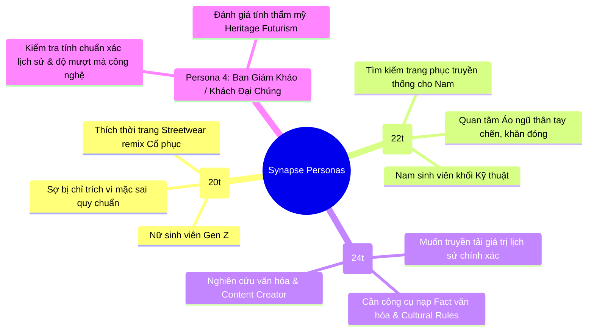

# TÀI LIỆU ĐẶC TẢ USER STORIES (USER-STORY.MD)

> **Dự án:** Synapse – V-Heritage Studio  
> **Chủ đề:** Nền tảng phối trang phục truyền thống theo phong cách Gen Z  
> **Phương pháp luận:** Agile / Scrum Framework & BDD (Behavior-Driven Development)  
> **Ngày phê duyệt:** 22/09/2026 | **Phiên bản:** 1.0.0  

---

## 1. HỆ THỐNG CHÂN DUNG NGƯỜI DÙNG (USER PERSONAS)

Để các User Story phản ánh chính xác bài toán thực tế của cuộc thi **Việt Phục Remix**, hệ thống xây dựng dựa trên 4 Personas đại diện:

### Chi tiết Personas:

1. **Persona 1 – Nguyễn Minh Anh (20 tuổi, Gen Z Fashion Creator):**
   * *Nhu cầu:* Muốn phối áo tấc / áo Nhật bình với chân váy hiện đại hoặc giày sneaker để chụp ảnh Tết và dự sự kiện tại trường.
   * *Nỗi đau (Pain Points):* Không biết phối thế nào cho đẹp mà không bị "phạm húy", không biết mua phụ kiện gì phù hợp, thiếu kiến thức về màu sắc truyền thống.
2. **Persona 2 – Trần Hoàng Long (22 tuổi, Sinh viên Đại học):**
   * *Nhu cầu:* Cần tìm một bộ Việt phục nam (áo ngũ thân tay chẽn) trang nghiêm để dự lễ tốt nghiệp, nhưng vẫn muốn nét trẻ trung, năng động.
   * *Nỗi đau (Pain Points):* Các ứng dụng và tư liệu trên thị trường đa số tập trung vào đồ nữ, thiếu thông tin và hình ảnh trực quan cho đồ nam.
3. **Persona 3 – Lê Thanh Hà (24 tuổi, Nhà nghiên cứu trẻ & Nhập liệu văn hóa):**
   * *Nhu cầu:* Cần một hệ thống phân loại trang phục và lưu trữ fact tri thức chuẩn mực theo triều đại mà không cần phải can thiệp trực tiếp vào mã nguồn phần mềm.
   * *Nỗi đau (Pain Points):* Nhiều nội dung trên mạng xã hội bịa đặt nguồn gốc hoặc sai lệch niên đại.
4. **Persona 4 – Khán giả & Giám khảo Audition:**
   * *Nhu cầu:* Trải nghiệm mượt mà, ấn tượng thị giác (Wow-effect), tính năng xuất ảnh Lookbook 9:16 chia sẻ mạng xã hội nhanh chóng.

---

## 2. DANH MỤC EPICS CỦA DỰ ÁN

* **EPIC 1: Onboarding & Khởi tạo Không gian Phối đồ (Persona Setup)**
* **EPIC 2: Core Canvas Paper-Doll Engine (Cơ chế Xếp lớp 6 Slot)**
* **EPIC 3: Hệ thống Bảng màu Cổ phong & Color Multiply Canvas**
* **EPIC 4: Cultural Factcard & Không gian Tri thức Sống (Living Cultural Hub)**
* **EPIC 5: Cultural Guardrails Engine (Cảnh báo Tinh tế & Hướng dẫn Văn hóa)**
* **EPIC 6: Chấm điểm Hòa sắc & Xuất Bản V-Lookbook Card (9:16 Social Sharing)**
* **EPIC 7: Quản trị Nội dung & Dữ liệu Văn hóa Không Dùng Code (Data-Driven Hub)**

---

## 3. CHI TIẾT CÁC USER STORIES & TIÊU CHÍ CHẤP NHẬN (ACCEPTANCE CRITERIA - BDD)

---

### EPIC 1: Onboarding & Khởi tạo Không gian Phối đồ

#### [US-01] Chọn Phom Mẫu Giới Tính (Nam / Nữ)
* **User Story:** Là một **người dùng mới (Minh Anh hoặc Hoàng Long)**, tôi muốn **chọn phom mẫu Mannequin Nam hoặc Nữ ngay khi mở ứng dụng**, để **tôi có thể bắt đầu phối đồ trên cơ thể phù hợp với giới tính mong muốn**.
* **Ưu tiên:** `🔴 P0 - Must Have` | **Story Points:** 2 SP | **Sprint:** `Sprint 0` & `Sprint 1`
* **Acceptance Criteria (Gherkin):**
  * **Scenario 1.1:** Khởi tạo Mannequin Nữ
    * *Given:* Người dùng đang ở màn hình Onboarding (Màn 1).
    * *When:* Người dùng nhấp chọn nút "Phom Mẫu Nữ" và bấm "Bắt đầu Phối đồ".
    * *Then:* Hệ thống chuyển mượt mà vào Studio (Màn 2) và hiển thị Mannequin Nữ chuẩn 800x1200 px ở chính giữa Canvas.
  * **Scenario 1.2:** Chuyển đổi giới tính linh hoạt trong Studio
    * *Given:* Người dùng đang ở màn hình Workspace (Màn 2).
    * *When:* Người dùng bấm nút chuyển giới tính sang "Nam" trên Topbar.
    * *Then:* Canvas cập nhật sang Mannequin Nam và làm mới danh mục trang phục tương thích với Nam giới mà không gây lỗi giao diện.

---

### EPIC 2: Core Canvas Paper-Doll Engine (Xếp lớp 6 Slot)

#### [US-02] Phối Trang Phục Theo Hệ Thống 6 Slot Chuẩn
* **User Story:** Là một **Gen Z Creator**, tôi muốn **thử các món đồ vào 6 slot cố định (`HEADWEAR`, `TOP`, `BOTTOM`, `PATTERN`, `ACCESSORY`, `FOOTWEAR`)**, để **tạo nên một bộ outfit hoàn chỉnh nhiều lớp mà không bị lệch phom dáng**.
* **Ưu tiên:** `🔴 P0 - Must Have` | **Story Points:** 5 SP | **Sprint:** `Sprint 1`
* **Acceptance Criteria (Gherkin):**
  * **Scenario 2.1:** Thêm trang phục vào đúng vị trí Layer
    * *Given:* Canvas đang hiển thị Mannequin cơ bản.
    * *When:* Người dùng mở Drawer `TOP` và chọn "Áo ngũ thân tay chẽn".
    * *Then:* Hình ảnh Áo ngũ thân (PNG trong suốt 800x1200 px) được vẽ đè lên Canvas tại đúng vị trí `(0, 0)` theo đúng thứ tự Z-Index của Slot `TOP`.
  * **Scenario 2.2:** Thay thế món đồ trong cùng một Slot
    * *Given:* Người dùng đang mặc "Áo ngũ thân tay chẽn" (Slot `TOP`).
    * *When:* Người dùng chọn tiếp "Áo tấc" (cũng thuộc Slot `TOP`).
    * *Then:* Hệ thống tự động thay thế "Áo ngũ thân" bằng "Áo tấc", các slot khác (`BOTTOM`, `HEADWEAR`) vẫn giữ nguyên.
  * **Scenario 2.3:** Tháo bỏ phụ kiện / trang phục (Remove Item)
    * *Given:* Người dùng đang đeo "Khăn đóng" (Slot `HEADWEAR`).
    * *When:* Người dùng bấm icon gỡ bỏ tại lớp `HEADWEAR` ở bảng Active Layers.
    * *Then:* Khăn đóng biến mất khỏi Canvas, trả lại đầu Mannequin tự nhiên.

---

### EPIC 3: Bảng Màu Cổ Phong & Color Multiply Canvas

#### [US-03] Đổi Màu Trang Phục Bằng 8 Màu Cổ Phong Việt Nam
* **User Story:** Là một **người yêu thẩm mỹ truyền thống**, tôi muốn **áp dụng nhanh 8 mã màu cổ phong (Đỏ điều, Vàng hoa mướp, Xanh chàm, Xanh cổ vịt, Tía ngọc, Trắng ngà, Đen mun, Nâu sồng)**, để **bộ trang phục mang đậm phong vị lịch sử và khí chất cung đình/dân gian**.
* **Ưu tiên:** `🟠 P1 - Should Have` | **Story Points:** 3 SP | **Sprint:** `Sprint 1`
* **Acceptance Criteria (Gherkin):**
  * **Scenario 3.1:** Chọn màu có sẵn trong bảng màu
    * *Given:* Người dùng đang chọn món đồ có cho phép tùy biến màu (`color_customizable = true`).
    * *When:* Người dùng nhấp vào chấm màu "Đỏ điều" (`#9E2A2B`) trên thanh Color Bar.
    * *Then:* Vải áo đổi sang tone Đỏ điều mượt mà bằng thuật toán Color Multiply mà vẫn giữ nguyên các nếp gấp đổ bóng của vải gốc.
  * **Scenario 3.2:** Khóa đổi màu với trang phục hoa văn đặc thù
    * *Given:* Người dùng chọn "Áo Nhật bình thêu ngũ sắc" (`color_customizable = false`).
    * *When:* Người dùng quan sát thanh Color Bar.
    * *Then:* Thanh đổi màu hiển thị trạng thái vô hiệu hóa kèm tooltip giải thích: *"Trang phục giữ nguyên màu gốc theo quy chế triều đình"*.

#### [US-04] Tùy Biến Màu Sắc Tự Do Bằng Hex Color Picker
* **User Story:** Là một **Gen Z Stylist thích phá cách**, tôi muốn **sử dụng công cụ chọn mã màu Hex tùy ý**, để **thử nghiệm những phong cách thời trang vị lai (Heritage Futurism) mới lạ như Cyberpunk Cổ phục**.
* **Ưu tiên:** `🟡 P2 - Could Have` | **Story Points:** 2 SP | **Sprint:** `Sprint 1`
* **Acceptance Criteria (Gherkin):**
  * **Scenario 4.1:** Nhập mã Hex tùy chọn
    * *Given:* Người dùng đang chọn một chiếc quần lụa trắng.
    * *When:* Người dùng mở bộ chọn màu mở rộng và nhập mã `#00F5D4` (Neon Teal).
    * *Then:* Lớp quần lập tức chuyển sang sắc thái Neon Teal chính xác.

---

### EPIC 4: Cultural Factcard & Không Gian Tri Thức Sống

#### [US-05] Xem Ý Nghĩa Lịch Sử & Mẹo Phối Đồ Hiện Đại (Factcard)
* **User Story:** Là một **học sinh / sinh viên (Minh Anh, Hoàng Long)**, tôi muốn **đọc thông tin nguồn gốc, ý nghĩa văn hóa và mẹo phối hiện đại ngay khi bấm vào món đồ**, để **tôi hiểu sâu sắc câu chuyện di sản đằng sau trang phục mình đang mặc**.
* **Ưu tiên:** `🔴 P0 - Must Have` | **Story Points:** 3 SP | **Sprint:** `Sprint 1`
* **Acceptance Criteria (Gherkin):**
  * **Scenario 5.1:** Hiển thị Factcard khi tương tác món đồ
    * *Given:* Người dùng click vào "Áo ngũ thân tay chẽn" trong Drawer hoặc trên người Mannequin.
    * *When:* Hệ thống nhận diện sự kiện click.
    * *Then:* Cột phải cập nhật Thẻ Cultural Factcard: hiển thị Triều đại (Triều Nguyễn), Ý nghĩa (5 khuy cài tượng trưng ngũ thường: Nhân, Lễ, Nghĩa, Trí, Tín) và Mẹo phối Gen Z (kết hợp với quần âu hoặc sneaker trắng).
  * **Scenario 5.2:** Đảm bảo dữ liệu chuẩn xác (Không bịa đặt)
    * *Given:* Factcard hiển thị nội dung.
    * *When:* Người dùng kiểm tra thông tin.
    * *Then:* Toàn bộ nội dung hiển thị phải được truy xuất trực tiếp từ bảng `cultural_facts` có nguồn khảo cứu đã duyệt.

---

### EPIC 5: Cultural Guardrails Engine (Cảnh Báo Văn Hóa Tinh Tế)

#### [US-06] Nhận Gợi Ý / Cảnh Báo Phối Đồ Thân Thiện Khi Phối Lệch Quy Chuẩn
* **User Story:** Là một **Gen Z muốn thể hiện cá tính**, tôi muốn **nhận được những lời nhắc nhở lịch sự và mang tính gợi ý xây dựng nếu tôi phối đồ có nguy cơ làm sai lệch trang phục truyền thống**, để **tôi có thể vừa tự do sáng tạo vừa không xúc phạm giá trị di sản**.
* **Ưu tiên:** `🔴 P0 - Must Have` | **Story Points:** 5 SP | **Sprint:** `Sprint 2`
* **Acceptance Criteria (Gherkin):**
  * **Scenario 6.1:** Áo ngũ thân thiếu quần dài (Vi phạm nghiêm trọng phom dáng)
    * *Given:* Người dùng chọn "Áo ngũ thân" (`TOP`) nhưng không chọn bất kỳ trang phục nào ở Slot `BOTTOM`.
    * *When:* Hệ thống Guardrails Engine kích hoạt đánh giá (`POST /api/rules/evaluate`).
    * *Then:* Một Toast Alert màu hổ phách/vàng xuất hiện với giọng điệu tích cực: *"Áo ngũ thân truyền thống thường đi cùng quần ống rộng để giữ dáng đứng trang nghiêm, bạn có muốn thử kết hợp thêm quần không?"*. Tuyệt đối không dùng từ ngữ tiêu cực như: *"Bạn sai rồi"*, *"Cấm mặc"*.
  * **Scenario 6.2:** Phối hợp hài hòa hợp lệ
    * *Given:* Người dùng chọn Áo ngũ thân + Quần lụa trắng + Giày sneaker trắng hiện đại.
    * *When:* Hệ thống đánh giá outfit.
    * *Then:* Hiển thị thông báo khuyến khích: *"Sự giao thoa tuyệt vời giữa nét trang nghiêm truyền thống và năng động hiện đại!"*.

---

### EPIC 6: Chấm Điểm Hòa Sắc & Xuất Bản V-Lookbook Card (9:16)

#### [US-07] Tự Động Chấm Điểm Hòa Sắc (Color Harmony Score)
* **User Story:** Là một **người phối đồ**, tôi muốn **hệ thống tự động chấm điểm độ hài hòa màu sắc (0 - 100) của cả bộ outfit**, để **tôi biết bộ phối của mình đạt mức độ thẩm mỹ như thế nào**.
* **Ưu tiên:** `🟠 P1 - Should Have` | **Story Points:** 3 SP | **Sprint:** `Sprint 2`
* **Acceptance Criteria (Gherkin):**
  * **Scenario 7.1:** Phối màu theo quy tắc ngũ hành / bánh xe màu
    * *Given:* Người dùng phối áo Tía ngọc kết hợp cùng phụ kiện Vàng hoa mướp (cặp màu tương phản hài hòa).
    * *When:* Hệ thống tính toán dựa trên thuật toán màu HSL/Hex.
    * *Then:* Điểm số hiển thị đạt từ 85 - 95 điểm kèm lời nhận xét ngắn: *"Độ tương phản cao quý, tôn dáng xuất sắc"*.

#### [US-08] Xuất Thẻ V-Lookbook 9:16 Để Tải Về & Chia Sẻ Mạng Xã Hội
* **User Story:** Là một **Creator muốn khoe tác phẩm trên Instagram Story / TikTok**, tôi muốn **xuất thẻ V-Lookbook dọc 9:16 chứa ảnh outfit, bảng màu, điểm số và trích dẫn văn hóa**, để **tôi có thể tải ảnh PNG chất lượng cao hoặc chia sẻ link cho bạn bè**.
* **Ưu tiên:** `🔴 P0 - Must Have` | **Story Points:** 5 SP | **Sprint:** `Sprint 2`
* **Acceptance Criteria (Gherkin):**
  * **Scenario 8.1:** Mở Modal Xuất V-Lookbook
    * *Given:* Người dùng hoàn thành bộ phối trên Studio.
    * *When:* Bấm nút gradient tím `[✨ Xuất V-Lookbook]`.
    * *Then:* Modal hiện lên với thiết kế thẻ 9:16 chuẩn Cinematic, hiển thị logo Synapse, tên tác phẩm, hình ảnh Canvas, bảng chấm màu và huy hiệu chuẩn văn hóa.
  * **Scenario 8.2:** Tải ảnh PNG chất lượng cao
    * *Given:* Đang ở màn hình V-Lookbook Modal.
    * *When:* Người dùng bấm nút `[💾 Tải ảnh PNG]`.
    * *Then:* Trình duyệt tự động render Canvas sang định dạng PNG độ phân giải sắc nét và tải về máy trong vòng dưới 2 giây.

---

### EPIC 7: Quản Trị Nội Dung & Dữ Liệu Văn Hóa Không Cần Code

#### [US-09] Thêm Mới & Chỉnh Sửa Dữ Liệu Qua Supabase Table Editor
* **User Story:** Là một **thành viên Research (Thanh Hà)**, tôi muốn **dễ dàng thêm mới món đồ, cập nhật niên đại, câu chuyện văn hóa qua giao diện bảng Supabase như Excel**, để **tôi có thể cập nhật kho tri thức mà không cần nhờ lập trình viên sửa code**.
* **Ưu tiên:** `🔴 P0 - Must Have` | **Story Points:** 3 SP | **Sprint:** `Sprint 0` & `Sprint 3`
* **Acceptance Criteria (Gherkin):**
  * **Scenario 9.1:** Nhập món đồ mới vào Supabase
    * *Given:* Thành viên nghiên cứu mở bảng `items` trên Supabase Table Editor.
    * *When:* Thêm một dòng mới: tên món đồ, slot `HEADWEAR`, Z-Index `60`, link ảnh Supabase Storage.
    * *Then:* Ứng dụng web Frontend tự động hiển thị món đồ mới trong tab `Mũ` ngay khi refresh mà không cần deploy lại code.

---

## 4. MA TRẬN PHÂN BỔ USER STORIES THEO SPRINT & NHỊP ĐỘ AGILE

| Mã US | Tên User Story | Epic | Người Hưởng Lợi | Điểm SP | Sprint | Trạng Thái Ban Đầu |
| :---: | :--- | :---: | :---: | :---: | :---: | :---: |
| **US-01** | Chọn Phom Mẫu Giới Tính (Nam / Nữ) | Epic 1 | Minh Anh, Hoàng Long | 2 SP | **Sprint 0** | Ready to Dev |
| **US-02** | Phối Trang Phục Theo Hệ Thống 6 Slot Chuẩn | Epic 2 | Gen Z Creator | 5 SP | **Sprint 1** | Backlog |
| **US-03** | Đổi Màu Bằng 8 Màu Cổ Phong Việt Nam | Epic 3 | Minh Anh, Hoàng Long | 3 SP | **Sprint 1** | Backlog |
| **US-04** | Tùy Biến Màu Sắc Tự Do Bằng Hex Color Picker | Epic 3 | Gen Z Stylist Phá Cách | 2 SP | **Sprint 1** | Backlog |
| **US-05** | Xem Ý Nghĩa Lịch Sử & Mẹo Phối Đồ (Factcard) | Epic 4 | Học sinh, Sinh viên | 3 SP | **Sprint 1** | Backlog |
| **US-06** | Nhận Cảnh Báo Văn Hóa Tinh Tế (Guardrails) | Epic 5 | Gen Z Creator | 5 SP | **Sprint 2** | Backlog |
| **US-07** | Tự Động Chấm Điểm Hòa Sắc (Color Harmony) | Epic 6 | Gen Z Creator | 3 SP | **Sprint 2** | Backlog |
| **US-08** | Xuất Thẻ V-Lookbook 9:16 & Chia Sẻ MXH | Epic 6 | Minh Anh, Giám khảo | 5 SP | **Sprint 2** | Backlog |
| **US-09** | Nhập Liệu Văn Hóa Không Cần Can Thiệp Code | Epic 7 | Thanh Hà (Research) | 3 SP | **Sprint 0** | Ready to Dev |

**Tổng Story Points:** **31 SP** (Ước lượng phù hợp cho 16 ngày Fast-Track 1 Dev + 2 Research + AI Copilot).
