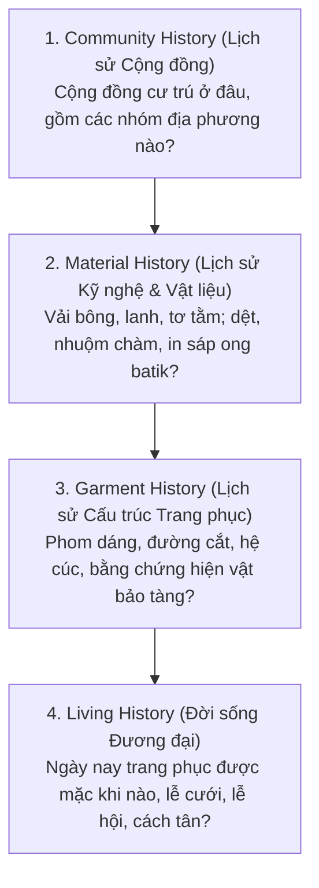

# Phương Pháp Luận Nghiên Cứu & Thang Đo Bằng Chứng (Evidence)

> **Tài liệu hướng dẫn kỹ thuật:** `docs/knowledge/guidelines/01-methodology-and-evidence.md`  
> **Áp dụng cho:** Đội ngũ Nghiên cứu Nội dung, AI Coding Agent, và Data Engineer  

---

## 1. Nguyên Tắc Phương Pháp Luận Cốt Lõi

Khi nghiên cứu, phục dựng và số hóa di sản trang phục Việt Nam trên nền tảng **Synapse**, toàn bộ đội ngũ phải tuân thủ nghiêm ngặt 3 nguyên lý học thuật sau:

### 1.1. Phân định rõ hai lớp di sản y phục
1. **Lớp Cổ phục Lịch sử (Historical Costume):**
   * Là hệ trang phục gắn liền với một giai đoạn lịch sử, triều đại phong kiến hoặc chế độ mặc (dress code) đã khép lại theo thể chế (ví dụ: Áo Giao lĩnh thời Lê, Áo Tấc/Nhật Bình thời Nguyễn).
   * Phương pháp tiếp cận: Dựa vào khảo cứu sử liệu, văn bản điển chế (Đại Nam thực lục, Khâm định Đại Nam hội điển sự lệ...), hiện vật khảo cổ, tranh tượng điêu khắc và tài liệu nghiên cứu chuyên khảo.
2. **Lớp Trang phục Truyền thống Tộc người (Living Heritage):**
   * Là di sản sống của các cộng đồng dân tộc (Thái, Dao Đỏ, Hmông, Ê-đê, Ba-na...), hiện vẫn đang được người dân trực tiếp may, dệt và mặc trong đời sống sinh hoạt, cưới hỏi hoặc lễ hội.
   * Phương pháp tiếp cận: Nghiên cứu dân tộc học, điền dã thực địa, công nghệ dệt may thủ công và ghi nhận sự biến đổi theo thời gian của cộng đồng.

> **Cảnh báo:** Hai lớp dữ liệu này có phương pháp tiếp cận và bản chất văn hóa khác nhau, **tuyệt đối không được trộn lẫn hoặc đánh đồng** trong cùng một bảng phân loại.

---

### 1.2. Bác bỏ định kiến tiến hóa đơn tuyến
Lịch sử y phục Việt Nam không phải là một chuỗi tiến hóa đơn giản từ cái này sinh ra cái kia theo mô hình tuyến tính:
$$\text{Giao lĩnh} \longrightarrow \text{Tứ thân} \longrightarrow \text{Ngũ thân} \longrightarrow \text{Áo dài}$$

Thực tế lịch sử chứng minh:
* Các dạng trang phục **đồng tồn tại** trong cùng một thời kỳ: Ở thế kỷ XVII–XVIII, trong khi cung đình và tầng lớp quý tộc sử dụng các dạng áo thụng, áo giao lĩnh thì phụ nữ nông thôn Bắc Bộ vẫn mặc áo tứ thân kết hợp yếm và váy; đồng thời ở Đàng Trong, hệ áo cổ đứng ngũ thân bắt đầu được định hình.
* Mỗi dạng áo đại diện cho một hoàn cảnh, tầng lớp, vùng địa lý và điều kiện sinh kế khác nhau chứ không phải dạng áo sau "xóa sổ" hay "tiến hóa" từ dạng áo trước.

---

## 2. Thang Đo 4 Cấp Độ Bằng Chứng (Evidence Levels)

Để đảm bảo tính trung thực học thuật và phân định rõ giữa **sự thật lịch sử** với **diễn giải suy đoán**, mọi hồ sơ trang phục và tri thức văn hóa hiển thị trong ứng dụng đều phải được gán nhãn theo thang đo 4 mức độ:

| Cấp độ | Tên gọi | Định nghĩa & Tiêu chuẩn xác thực | Cách xử lý trong Database & AI |
| :---: | :--- | :--- | :--- |
| **A** | **Hiện vật Bảo tàng / Tư liệu Sơ cấp** | Có hiện vật thực tế được lưu giữ tại các bảo tàng uy tín (Bảo tàng Lịch sử Quốc gia, Bảo tàng Dân tộc học VN...), có mã sưu tầm, địa bàn thu thập, năm sưu tầm và bản giám định chuyên môn; hoặc trích lục từ văn bản điển chế gốc. | Mức tin cậy tuyệt đối (`confidence = 1.0`). Được dùng làm chuẩn xác lập cấu trúc, tọa độ và chi tiết cắt may. |
| **B** | **Nghiên cứu / Chuyên khảo Khoa học** | Được công bố trong các công trình nghiên cứu học thuật của các nhà nghiên cứu uy tín (ví dụ: *Ngàn năm áo mũ* của Trần Quang Đức), kỷ yếu hội thảo khoa học, luận án tiến sĩ hoặc chuyên khảo dân tộc học. | Mức tin cậy cao (`confidence = 0.85`). Đủ điều kiện để lập luận văn hóa và thiết lập Cultural Rules. |
| **C** | **Cơ quan Văn hóa / Báo chí Chuyên ngành** | Thông tin từ các triển lãm của Sở Văn hóa, website chính thống của các viện nghiên cứu, bài viết của chuyên gia văn hóa trên báo chí uy tín (VietnamPlus, Nhân Dân, TTXVN...). | Mức tin cậy bổ trợ (`confidence = 0.65`). Dùng để cập nhật bối cảnh đương đại; không dùng để định đoạt niên đại cổ xưa. |
| **D** | **Diễn giải Phổ biến / Dân gian** | Những câu chuyện truyền miệng, cách giải thích mang tính biểu tượng dân gian chưa có tư liệu sơ cấp kiểm chứng (ví dụ: gán 5 cúc áo ngũ thân cho ngũ thường). | Phải gắn nhãn *"Diễn giải biểu tượng phổ biến"* hoặc *"Đang tranh luận"*. AI tuyệt đối không khẳng định đây là sự thật lịch sử. |

---

## 3. Mô Hình Hiển Thị 4 Lớp: "Historical Story"

Thay vì hiển thị một đoạn văn tĩnh mơ hồ về "nguồn gốc", giao diện ứng dụng Synapse và các thẻ tri thức (`cultural_facts`) sẽ phân rã câu chuyện văn hóa thành 4 lớp sinh động:

*Ví dụ áp dụng với Áo dài nữ Dao Đỏ:*
1. **Community History:** Nhóm Dao Đỏ di cư vào Việt Nam từ thế kỷ XIII, cư trú tại vùng núi phía Bắc.
2. **Material History:** Dệt vải bông thủ công, nhuộm chàm nhiều lần tạo sắc đen tuyền sâu thẳm.
3. **Garment History:** Áo dài xẻ ngực không khuy, nẹp ngực đính hạt cườm len đỏ rực rỡ (Hiện vật Nà Tông năm 1995 tại Bảo tàng Dân tộc học).
4. **Living History:** Hiện vẫn là lễ phục không thể thiếu trong lễ Cấp Sắc, đám cưới và ngày hội đầu xuân của đồng bào Dao.
