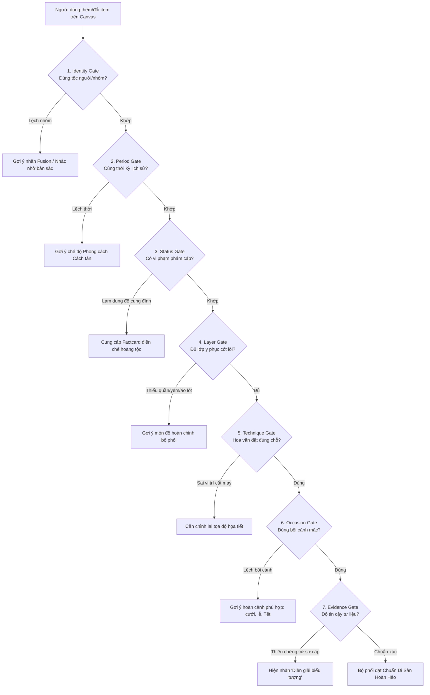

# Hệ Thống 7 Cổng Kiểm Soát Văn Hóa (Cultural Guardrails Engine)

> **Tài liệu hướng dẫn kỹ thuật:** `docs/knowledge/guidelines/02-cultural-guardrails.md`  
> **Áp dụng cho:** Backend `rules.service.ts`, Frontend `guardrails.service.ts`, và AI Coding Agent  

---

## 1. Triết Lý & Giọng Văn Cảnh Báo (Tone of Voice)

Theo quy định tối cao tại [GEMINI.md](../../GEMINI.md), hệ thống **Cultural Guardrails** đóng vai trò là một **"Người Bạn Đồng Hành Văn Hóa" (Friendly Cultural Companion)** nhằm khơi dậy tình yêu di sản cho thế hệ Gen Z, tuyệt đối không đóng vai trò "cảnh sát thời trang" hay thẩm phán văn hóa.

* **Nguyên tắc vàng về ngôn từ:**
  * **CẤM:** Không dùng từ ngữ mang tính tiêu cực, gay gắt, cấm đoán hoặc phán xét sai trái (như *"Bạn phối đồ sai quy tắc lịch sử"*, *"Lỗi nghiêm trọng"*, *"Vi phạm di sản"*).
  * **KHUYẾN KHÍCH:** Dùng câu hỏi gợi mở, lời nhắc nhẹ nhàng và cung cấp kiến thức nền hữu ích kèm phương án đề xuất (như *"Áo ngũ thân truyền thống thường đi cùng quần lụa trắng hoặc đen ống rộng để giữ dáng đứng trang nghiêm, bạn có muốn thử thêm quần không?"*).

---

## 2. Đặc Tả Chi Tiết 7 Cổng Kiểm Soát Văn Hóa (The 7 AI Gates)



### 2.1. Cổng 1: Identity Gate (Định danh Tộc người & Nhóm địa phương)
* **Mục đích:** Đảm bảo trang phục thuộc đúng cộng đồng văn hóa, không ghép râu ông nọ cắm cằm bà kia giữa các nhóm tộc người.
* **Điều kiện kích hoạt:** Phát hiện người dùng kết hợp chi tiết của các tộc người khác nhau mà không bật cờ `fusion_mode = true` (ví dụ: Áo cóm người Thái kết hợp khăn mấn Dao Đỏ).
* **Thông báo gợi mở:** *"Bạn đang kết hợp nét duyên của áo cóm Thái cùng sắc đỏ rực rỡ của người Dao! Đây là một sự thử nghiệm giao thoa thú vị. Để chuẩn mực nét đẹp nguyên bản từng tộc người, bạn có thể chọn thêm khăn Piêu Thái nhé!"*

### 2.2. Cổng 2: Period Gate (Niên đại & Thời kỳ Lịch sử)
* **Mục đích:** Ngăn việc nhầm lẫn giữa các triều đại lịch sử khác nhau khi người dùng đang ở chế độ "Phục dựng Lịch sử" (Historical Reconstruction).
* **Điều kiện kích hoạt:** Phối trang phục thời Lê (áo giao lĩnh) cùng phụ kiện thời Nguyễn (khăn đóng hiện đại) ở chế độ chuẩn lịch sử.
* **Thông báo gợi mở:** *"Áo giao lĩnh mang đậm dấu ấn thời Lê tiền Nguyễn, trong khi khăn đóng tròn phổ biến từ thời Nguyễn muộn. Bạn có thể chọn búi tóc/cài trâm cổ phong để tái hiện trọn vẹn phong thái thời Lê nhé!"*

### 2.3. Cổng 3: Status Gate (Phẩm cấp & Tôn ti Cung đình)
* **Mục đích:** Tôn trọng quy chế y quan triều đình, không biến lễ phục hoàng gia thành đồ mặc tùy tiện.
* **Điều kiện kích hoạt:** Chọn áo Nhật Bình thêu phụng hoàng (dành cho Hoàng Thái hậu/Hoàng hậu) nhưng lại phối với phụ kiện dân dã hoặc màu sắc cấm kỵ theo phẩm cấp.
* **Thông báo gợi mở:** *"Áo Nhật Bình với hoa văn phụng hoàng vốn là phẩm phục tôn quý bậc nhất chốn hoàng cung triều Nguyễn. Để hoàn thiện vẻ đài các, một chiếc khăn vành dây vàng hoặc mũ kim phượng sẽ tôn lên thần thái cao quý của bộ đồ!"*

### 2.4. Cổng 4: Layer Gate (Độ Hoàn Chỉnh Về Lớp Xếp - Layering)
* **Mục đích:** Đảm bảo người dùng mặc đủ các lớp trang phục thiết yếu để giữ sự trang nghiêm và nét kín đáo của cổ phục Việt.
* **Điều kiện kích hoạt:** Mặc áo ngũ thân hoặc áo tấc mà chưa chọn quần lụa ở slot `BOTTOM`; hoặc mặc áo tứ thân mà thiếu yếm lót ở slot `INNER_TOP`.
* **Thông báo gợi mở:** *"Cổ phục Việt Nam đề cao sự chỉnh tề, kín đáo. Tà áo ngũ thân/áo tấc thướt tha sẽ tôn dáng nhất khi đi cùng một chiếc quần lụa ống rộng màu trắng hoặc đen tuyền. Bạn hãy thử ghé ngăn Quần nhé!"*

### 2.5. Cổng 5: Technique Gate (Quy chuẩn Kỹ thuật & Vị trí Họa tiết)
* **Mục đích:** Ngăn chặn AI tự sinh họa tiết ngẫu nhiên phủ kín bề mặt vải (texture all-over) trái với kỹ thuật dệt may truyền thống.
* **Quy chuẩn:** Hoa văn thủy ba, mây ngũ sắc của người Kinh phải nằm ở gấu áo/cửa tay; hoa văn dệt thổ cẩm của người Ê-đê, Ba-na phải chạy theo dải dệt ngang tấm vải; họa tiết sáp ong Hmông phải nằm ở dải giữa váy xếp ly.

### 2.6. Cổng 6: Occasion Gate (Bối cảnh & Không gian Sử dụng)
* **Mục đích:** Hướng dẫn người dùng mặc trang phục đúng dịp (Thường nhật, Hôn lễ, Hội làng, Nghi lễ tâm linh).
* **Điều kiện kích hoạt:** Chọn áo tấc tay thụng (vốn là lễ phục trang trọng dùng trong tế lễ, cưới hỏi) nhưng lại chọn vibe phong cách dạo phố thường nhật tối giản.
* **Thông báo gợi mở:** *"Áo tấc tay thụng là lễ phục trang trọng thường xuất hiện trong các dịp đại lễ, cưới hỏi và chúc Tết đầu năm. Nếu bạn muốn diện đi làm hoặc dạo phố linh hoạt, áo ngũ thân tay chẽn gọn gàng sẽ là lựa chọn tuyệt vời!"*

### 2.7. Cổng 7: Evidence Gate (Tính Minh Bạch Về Nguồn Chứng Cứ)
* **Mục đích:** Đảm bảo mọi luận điểm văn hóa hiển thị đều rõ ràng về độ tin cậy.
* **Quy chuẩn:**
  * Thông tin mức $A$/$B$: Hiển thị trực tiếp kèm huy hiệu xanh lá *"Chứng cứ Bảo tàng / Khảo cứu học thuật"*.
  * Thông tin mức $D$ (diễn giải truyền miệng): Hiển thị huy hiệu vàng *"Diễn giải biểu tượng dân gian – Cần kiểm chứng thêm"*.

---

## 3. Cấu Trúc Dữ Liệu Rule Trả Về (JSON Schema)

Mỗi khi động cơ kiểm tra phối đồ quét bộ outfit, kết quả trả về từ `rules.service.ts` phải tuân thủ nghiêm ngặt giao ước sau:

```typescript
interface CulturalGuardrailResult {
  passed: boolean;
  active_rules_checked: number;
  alerts: CulturalAlert[];
}

interface CulturalAlert {
  gate: 'IDENTITY' | 'PERIOD' | 'STATUS' | 'LAYER' | 'TECHNIQUE' | 'OCCASION' | 'EVIDENCE';
  severity: 'info' | 'suggestion' | 'cultural_note'; // Tuyệt đối không dùng 'error' hay 'violation'
  message: string;
  historical_context: string;
  suggested_action?: {
    slot: 'HEADWEAR' | 'TOP' | 'BOTTOM' | 'PATTERN' | 'ACCESSORY' | 'FOOTWEAR';
    recommended_item_id?: string;
    action_label: string;
  };
}
```
