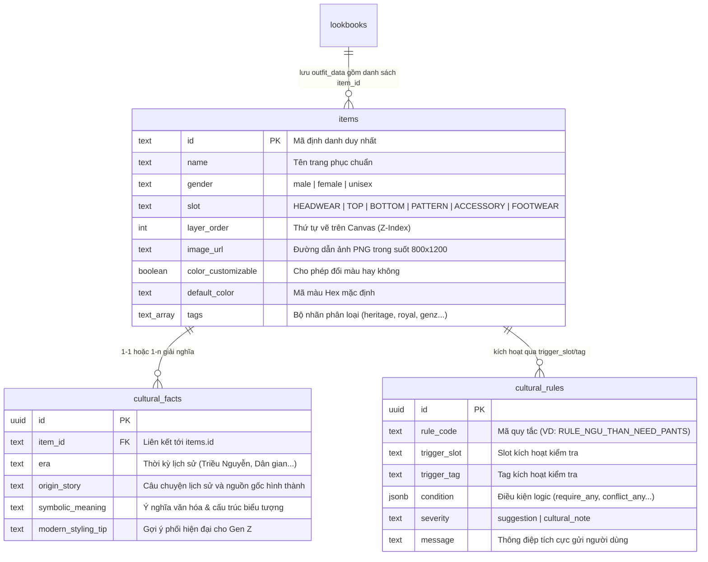

# Quy Chuẩn Ánh Xạ Dữ Liệu Sang CSDL Supabase (Database Mapping Spec)

> **Tài liệu hướng dẫn kỹ thuật:** `docs/knowledge/schema/02-database-mapping-spec.md`  
> **Áp dụng cho:** Backend Developer, Database Administrator, và Data Migration Scripts  
> **Tài liệu tham chiếu:** [docs/shared/DATABASE-SCHEMA.sql](../shared/DATABASE-SCHEMA.sql)  

---

## 1. Giới Thiệu Chung

Tài liệu này định nghĩa phương pháp chuyển đổi (transform & map) từ các hồ sơ nghiên cứu trong [docs/knowledge/costumes/](../costumes/) thành các bản ghi dữ liệu cụ thể trong 4 bảng cốt lõi của **Supabase PostgreSQL**.

---

## 2. Ma Trận Ánh Xạ Dữ Liệu (Knowledge to Database Mapping)



---

## 3. Quy Chuẩn Chi Tiết Từng Bảng Dữ Liệu

### 3.1. Bảng `items` (Danh Mục Trang Phục & Phụ Kiện)
Ánh xạ từ trục **Identity**, **Silhouette**, **Layering** và **Material**:
* `id`: Chuỗi viết hoa dạng snake_case có tiền tố danh mục, ví dụ: `TOP_KINH_NGU_THAN_TAY_CHEN`, `HEAD_KINH_KHAN_DONG`.
* `name`: Tên tiếng Việt chuẩn mực, tôn vinh truyền thống (VD: *"Áo Ngũ Thân Tay Chẽn"*).
* `gender`: Chuẩn hóa 3 giá trị `'male'`, `'female'`, `'unisex'`.
* `slot`: 1 trong 6 vị trí cố định trên cơ thể: `'HEADWEAR'`, `'TOP'`, `'BOTTOM'`, `'PATTERN'`, `'ACCESSORY'`, `'FOOTWEAR'`.
* `layer_order`: Số nguyên quy định Z-Index khi vẽ Canvas:
  * `BOTTOM`: 10
  * `TOP`: 20
  * `PATTERN`: 30
  * `FOOTWEAR`: 40
  * `HEADWEAR`: 50
  * `ACCESSORY`: 60
* `color_customizable`: `true` nếu là áo lụa/vải trơn có thể đổi màu qua bộ 8 màu cổ phong; `false` nếu là áo thêu phụng hoàng cung đình hoặc vải thổ cẩm hoa văn cố định.

---

### 3.2. Bảng `cultural_facts` (Thẻ Tri Thức Văn Hóa)
Ánh xạ từ trục **Context & Evidence**, câu chuyện lịch sử 4 lớp:
* `era`: Chuỗi tóm tắt triều đại và thời kỳ (ví dụ: *"Triều Nguyễn (Thế kỷ XIX – Đầu thế kỷ XX)"*).
* `origin_story`: Tóm lược ngắn gọn, hấp dẫn nguồn gốc ra đời, bối cảnh chính trị, sinh kế tạo nên trang phục.
* `symbolic_meaning`: Giải thích cấu trúc hạt nhân (cổ áo, vạt khép, số cúc, dải hoa văn) kèm ghi chú phân định rõ sự thật lịch sử vs diễn giải biểu tượng.
* `modern_styling_tip`: Lời khuyên phối đồ sáng tạo cùng phụ kiện hiện đại (quạt lụa, sneaker, kính mát) theo phong cách *Heritage Futurism*.

---

### 3.3. Bảng `cultural_rules` (Quy Tắc Kiểm Soát Phối Đồ)
Ánh xạ từ tài liệu [guidelines/02-cultural-guardrails.md](../guidelines/02-cultural-guardrails.md):
* `rule_code`: Định danh luật (ví dụ: `RULE_NGU_THAN_NEED_PANTS`, `RULE_NHAT_BINH_ROYAL_ONLY`).
* `trigger_slot` / `trigger_tag`: Điều kiện kích hoạt khi người dùng đặt item vào slot hoặc item có tag tương ứng.
* `condition`: Cấu trúc JSON chứa logic kiểm tra:
  ```json
  {
    "type": "REQUIRE_SLOT",
    "required_slot": "BOTTOM",
    "valid_tags": ["silk_pants", "traditional_pants"]
  }
  ```
* `severity`: Luôn dùng `'suggestion'` hoặc `'cultural_note'` (không dùng 'error').
* `message`: Lời nhắc tích cực, nhẹ nhàng theo chuẩn [GEMINI.md](../../GEMINI.md).

---

## 4. Dữ Liệu Mẫu Chuẩn (Seed Data JSON Example)

```json
{
  "item": {
    "id": "TOP_KINH_NGU_THAN_TAY_CHEN",
    "name": "Áo Ngũ Thân Lập Lĩnh Tay Chẽn",
    "gender": "unisex",
    "slot": "TOP",
    "layer_order": 20,
    "image_url": "https://pub-your-bucket.supabase.co/storage/v1/object/public/item-assets/top_ngu_than_tay_chen.png",
    "color_customizable": true,
    "default_color": "#264653",
    "tags": ["heritage", "nguyen_dynasty", "formal", "court_approved"]
  },
  "cultural_fact": {
    "item_id": "TOP_KINH_NGU_THAN_TAY_CHEN",
    "era": "Triều Nguyễn (Từ định chế 1744 đến đầu thế kỷ XX)",
    "origin_story": "Bắt nguồn từ cuộc cải cách định chế y phục năm 1744 của chúa Nguyễn Phúc Khoát ở Đàng Trong nhằm định hình bản sắc văn hóa riêng, sau đó được hoàn thiện và áp dụng trên toàn quốc dưới triều vua Minh Mạng.",
    "symbolic_meaning": "Áo có cổ đứng trang nghiêm (lập lĩnh), 5 thân ghép từ các khổ vải hẹp truyền thống và 5 khuy cài vạt phải. Trong dân gian, 5 thân được gửi gắm biểu tượng tứ thân phụ mẫu và chính mình; 5 cúc tượng trưng cho ngũ thường (Nhân - Lễ - Nghĩa - Trí - Tín).",
    "modern_styling_tip": "Phối cùng quần lụa ống rộng màu trắng hoặc đen tuyền. Giới trẻ có thể tạo điểm nhấn phá cách bằng cách kết hợp cùng giày sneaker trắng và quạt lụa cổ phong!"
  },
  "cultural_rule": {
    "rule_code": "RULE_NGU_THAN_PANTS_REQUIRED",
    "trigger_slot": "TOP",
    "trigger_tag": "nguyen_dynasty",
    "condition": {
      "require_slot": "BOTTOM",
      "required_tags": ["silk_pants"]
    },
    "severity": "suggestion",
    "message": "Áo ngũ thân truyền thống thường đi cùng quần lụa ống rộng để giữ dáng đứng trang nghiêm, bạn có muốn thử kết hợp thêm một chiếc quần lụa không?"
  }
}
```
